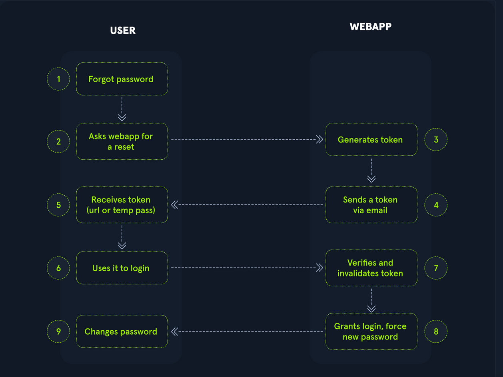

# Enumerating Users:
User enumeration vulnerabilities arise when a web app responds diffently to registrered/ valid and invalid inputs for authentication enpoints. Users enumerations
vulnerabilities frequently occur in funtions based on the user's username, such as user login, user registration, and pass reset.

Web developers frequently  overlook user enumeration vectors, assuming that information such as usernames is not confidential. Usernames can be considered confidentials
of they are the primary identifier required for authentication in web app. Users thend to use the same username across varius services other than web app, including FTP or RDP, and SSH.
Since many web app allow us to identify usernames, we can enumerate valid usernames and use them for futher attacks on authentication. This is often possible cuase web app typicallyu consider
a username or user's email address as the primary identifier.

- User Enumeration Theory:
Protection against username enumeration attacks can have an impact on user experience, a web app revealing whether a username exists may help a legitime user identify that they failed to type their
username correctly. The same applies an attackers trying to determine valid username.
As we can see in Wordpress user enumeration can be a secrity risk that web app deliberately accepts to provide a service, as another example, consider a chat app enabling users to chat with other.
This apps might provide a funtionality to search for users by their suername. This funtionality can be used to enumerate all users on th platform, its also to the service provided byt the web app.
User enumeration is now always a security vulnerability, it should be avoided of possible as a defense-in-depth measure.
- Enumerating User via DIffering Error Message:
To obtain a list of valid user, an attacker typically requires a wordlist of usernames to test. Usernames are often far less complicated then pass. They rarely contain special characters when they are not mail addr,
a list of commom use attackers to narrow scope of a brute force or carry out targetef attacks against supports employees or users, A common pass could be easily sprayed against valid account, often leading to a successul
account compromise. Ways of harvesting  usernames ara crawlin a web app or using information, such as company profiles on social networks.
[Seclists/Usernames/...]

Lets exploit this difference in error message returned and use Seclist's wordlist [xato...] to enumerate valid users with ffuf. We can specify the wordlist witht the -w parameter, the POST data with the -d parameter. and the
keyword FUZZ in the username to fuzz valid users. We can filter out valid users by removing responst containing the string Unknown user:

```sh
ffuf -w Dictionaries/SecLists/Usernames/xato-net-10-million-usernames.txt -u [IP] -X POST -H "Content-Type: appplication/x-www-form-urlencoded" -d "username=FUZZ&password=invalid" -fr "Unknwon user"
```
We  successulfully identify the valid username [consulo], we could proceed by attempting the brute-force the user's pass, as we will dicuss in the section.

- User Enumeration via Side Channel Attacks:
While difference in the web app response are the simplest and most obvious way to enumerate valid username, we might also be able to enumerate valid usernames via side channels. Side-channel attacks do not directly target the web app
response but rather extra nformation that can be obtained or inferred form the response.
Suppose a web app does database looksup only for valid usernames. We might be able to mesure a difference in the response time and enumerate valid username this way, User enumeration based on response timing is covered in the Whitebox attack.
```sh
 ffuf -w Dictionaries/SecLists/Usernames/xato-net-10-million-usernames.txt -u http://83.136.249.53:30687 -X POST -d "username=FUZZ&password=Academy_student\!" -H "Content-Type: application/x-www-form-urlencoded" -fr "Unknown user" -fc 3264

        /'___\  /'___\           /'___\
       /\ \__/ /\ \__/  __  __  /\ \__/
       \ \ ,__\\ \ ,__\/\ \/\ \ \ \ ,__\
        \ \ \_/ \ \ \_/\ \ \_\ \ \ \ \_/
         \ \_\   \ \_\  \ \____/  \ \_\
          \/_/    \/_/   \/___/    \/_/

       v2.1.0-dev
________________________________________________

 :: Method           : POST
 :: URL              : http://83.136.249.53:30687
 :: Wordlist         : FUZZ: /home/Anchovy/Dictionaries/SecLists/Usernames/xato-net-10-million-usernames.txt
 :: Header           : Content-Type: application/x-www-form-urlencoded
 :: Data             : username=FUZZ&password=Academy_student!
 :: Follow redirects : false
 :: Calibration      : false
 :: Timeout          : 10
 :: Threads          : 40
 :: Matcher          : Response status: 200-299,301,302,307,401,403,405,500
 :: Filter           : Response status: 3264
 :: Filter           : Regexp: Unknown user
________________________________________________

cookster                [Status: 200, Size: 3271, Words: 754, Lines: 103, Duration: 557ms]

```

## Brute-Forcing Passwords:
While a pas Brute-Forcing is not the focus of this module, passwords rmain one of the most common online auth methods, yet thaty are plagued with many issues, one prominint issues is pass resuses,
where individual use tha same pass across multiple accounts. This practice poses a significant security risk cause if one account is compromised, attackers can potentially  gain access, to other account
with the same credentials.
This enables an attacker who obtained a list of passs form a pass leak to try the sma pass on other web app. Another issues is weak pass based typical pharases, dictionary words, or simple patterns.
The most popular wordlist rockyou.txt contains 14 millions passwords:
```sh
wc -l Dictionaries/rockyou.txt
14344391 Dictionaries/rockyou.txt
grep '[[:upper:]]' Dictionaries/rockyou.txt  | grep '[[:lower:]]' | grep '[[:digit:]]' | grep -E '.{10}' > custom_wordlist.txt
grep: Dictionaries/rockyou.txt: binary file matches
wc -l custom_wordlist.txt
151647 custom_wordlist.txt
```
To start brute-forcing pass, we need a user or a list of users to target, Using the tech covered in the prv section, we determinate that admin us a username for a valid user, we'll attempt brute-forcing its password.
Intercept the post parameter and error message returned within the reponse.

Providing a incorrect user, the login response contains the message 'invalid user' we ca use this information to build ffuf command to brute force.
`ffuf -w ./custom_wordlist.txt -u http://172.17.0.2/index.php -X POST -H "Content-Type: application/x-www-form-urlencoded" -d "username=admin&password=FUZZ" -fr "Invalid username"`

More details on creating custom wordlist and attacking pass-baed auth, check out the:
[Cracking Passwords with Hashcat]()
[Passwords attacks]()
[Login Brute Brute-Forcing]()
`ffuf -w custom_wordlist.txt -u http://94.237.53.203:57026/ -X POST -H "Content-Type: application/x-www-form-urlencoded" -d "username=admin&password=FUZZ" -fr "Invalid username or password"`

## Bruete-Forcing Password Reset Tokens:
- Identifying Weak Reset Tokens:
Reset tokens are secret data generated by an appp when user requests a password reset. the user can then change their password the reset token. Since the password reset tokens enable an attacker to reset account's passwords. without
knowledge of the pass. They can be leveraged as an attack vector to take over a victim's account if implemented incorrectly. Pass reset can be complicated cause they consist of several sequential steps; basic pass reset flow is shows:


To identify weak reset tokens, we typically need to created an account on the target web app, request a pass reset tokens, and then
analyze it. Let us assume we have recieved the following pass reset email:
```txt
Hello,

We have received a request to reset the password associated with your account. To proceed with resetting your password, please follow the instructions below:

1. Click on the following link to reset your password: Click

2. If the above link doesn't work, copy and paste the following URL into your web browser: http://weak_reset.htb/reset_password.php?token=7351

Please note that this link will expire in 24 hours, so please complete the password reset process as soon as possible. If you did not request a password reset, please disregard this e-mail.

Thank you.
```
The passs reset link contains the reset token int the GET-parameter token, the token is 7351, given that the token consist of only 4-digits
there can only 10,000 possible values.

- Attacking Weak reset tokens:
We'll use ffuf to brute-force all possible reset tokens, we need to create a wordlist of all possible tokens form 0000 to 9999, which we can achieve with seq:
`seq -w 0 9999 > token.txt`

The flag -w pads all numbers the same legnth by prepeding zeroes, which we can verify by looking at the first few lines of the out file:

`head token.txt`

- FFUF Command:
`ffuf -w ./tokens.txt -u http://weak_reset.htb/reset_password.php?token=FUZZ -fr "The provided token is invalid"`
We must specifying the GET-parameter token in the /reset_password.pgp endpoint.
`ffuf -w tokens.txt -u 'http://83.136.252.13:31974/reset_password.php?token=FUZZ' -fr "The provided token is invalid" `


## Brute-Forcing 2FA codes:
2FA provides an additional layer of security to protect user accounts form unanthorized access, this is archived by combining knowledge-based auth ass with ownership-based
auth.
Can also be archived by combining any other two major three auth categiries we dicussed, 2FA can also be archived by combining any other two of the major three auth categories
we discussed previusly. Also makes significantly more difficult for attackers to acces an account even if they manage to obtain the user's credentials.

- Attacking 2FA:
One most commmon 2fa implementations relies on the user's pass and a time-based one-time pass(TOTP) provided to the user's smartphone by an auth  app or via SMS, Typically consist
only of digit, making them potentially guessable if the length is insufficient and the web app does not implement mesaure against successive of incorrect TOTPs. We'll assume that we obtain
valid credentials in a prior phishing attack: [admin:admin] The web app is secured with 2fa, as we can see after loggin in with the credentials obtained.

The message in the web app shows that the TOTP is a 4-digit code, since there are only 10000 possible variations, we can ez try all possible codes.
TOTP is passed on the otp POST parameter, we need to specify our session token in the PHPSESSIONID cookie to associate the TOTP with our auth session. Just like previus section to generate 4-digits
number from 0000 to 9999 like so:
`seq -w 0 9999 > token.txt`

`ffuf -w ./tokens.txt -u http://bf_2fa.htb/2fa.php -X POST -H "Content-Type: application/x-www-form-urlencoded" -b "PHPSESSID=fpfcm5b8dh1ibfa7idg0he7l93" -d "otp=FUZZ" -fr "Invalid 2FA Code"`

AS we can see we hits, that's cause oru session successulfully passed 2fa check after we had supplied the correct TOTP. Since 6513 was the first hit, we can assume this was the correct TOTP.
Our session is marked ad fully auth, so all request using oir session cookie are redirected to /admin.php. To access the protected page, we cn simply access the endpoint /admin.php


## Weak Brute-Force Protection:
- Rate Limits:
Is a crucial techniques employes in software developmnents and networks mangnament to control the rate of incomong requests to a system or API, primamry purpouse is to prevent sercers form begin overwhelmed  by too many
requests at once, prevent system downtime, and prevent brute-forcing attacks.
by limit the request allowed within a specified time frame, rate limit helps mainitain stablitily and ensures faur usagee of resources for all users.
When an attacker conducts a brute-force attack and hits the rate limit, the attackers will thwantered, A rate limit typically increment the response time iteratively until a bruteforcing, attack becomes infesasible or blocks
the attacker accessing the service for certain amount of time.
A rate limit should onlu be enforrced onmn an attacker, not regular user, to prevent DoS scenarios. Many rate limit implement raly on the IP address to identify the attacker. In a real scenario, obtaining the attackers IP address
might not always be as simple as it seems.
For instance, if there are middleboxes such as reverse proxies, load balancers, or web caches, a request's source IP address will belong to the middlebox, not the attacker. Thus, some rate limits rely on HTTP headers such as X-Forwarded-For to obtain the actual source IP address.
This enables an attacker to conduct a brute-force attack by randomizing the X-Forwarded-For header in each HTTP request to avoid the rate limit. Vulnerabilities like this occur frequently in the real world, for instance, as reported in CVE-2020-35590.

- CAPTCHAs:
A completely automated public turning test to tell computers and humand apart is a security measure to prevent bots form submitting requests. Forcing humans to make requests instead of bots or script, brute-force become a manual task,
making them infestable in mist ccaes.
By requiring users to complete these challenges before accessing certain features or submitting forms, CAPTCHAs help prevent automated scripts from performing actions that could be harmful, such as spamming forums, creating fake accounts, or launching brute-force attacks on login pages.

