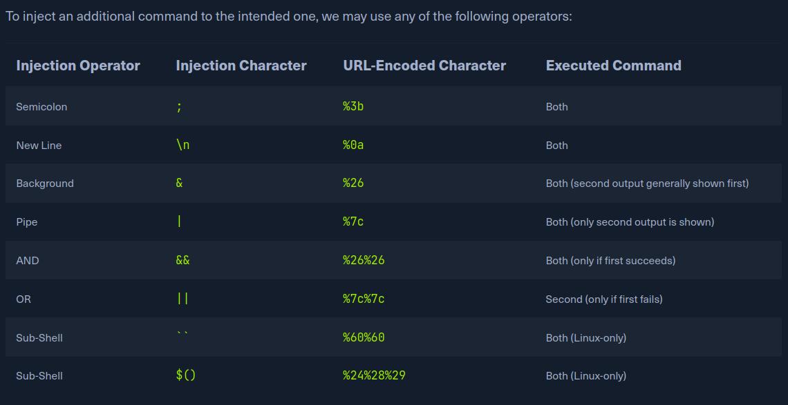
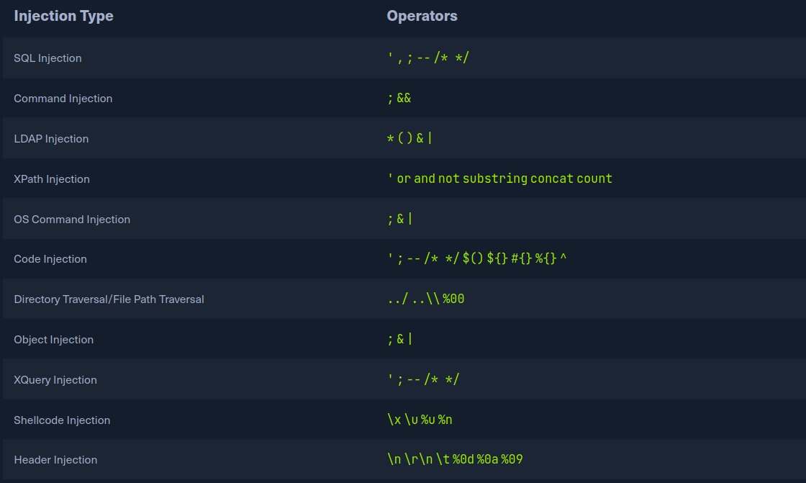

# Detection:
The process of detection basic OS command Injection vulnerabilies is the same process for exploting such vulnerabilies. We attempt to append
our command through varius injection methods. If the command output changes from intended ussual, result we have successfully exploited.
The may not be true for more advanced command injection vulnerabilies cause we may utilizing fuzzing methods or code review  to identify protential
comannd injection. We may then gradually build our payload until achieve command injection.

- Command injection detection:
We can visit the web appp in the below, we see [Hot checker] utility that apparers to ask for an IP to check whether it's alive or not.
We can try entering the localhost IP 127.0.0.1 to check the funtionality, it's returned the output of the ping command telling us the localhost.
Although we do not have access to the source code of the web app, we can confidently guess that the IP we entered is going into a ping command sice the output
we recieve suggests that.
`ping -c 1 OUR_INPUT`

- Command Injection Methods:
The inject an additional command to the intented one:

We can use any of these operators to inject another command so both or either of the commands get executed. We could write our expected input, then use of the above operators, and thenm write our new command.
> [!TIP]
> There are a few unix-only operators, that would work on Linux and MAc, but would not work on Windows, sich as wrapping our injected command with double backtiscks('') or with a sub-shell operator($()).

In general for basic command injection, all of these operators can be used for command injection regardless of the web app languages, frameworks, or back server. If we  inejecting in PHP web ap on a Linux server
or .NET web app running on a Windows back-end server, Or NodeJS web app running on a macOS server.
Windows accepts the semi-colon; which will not work if the command was begin executed with Windows Command Line, but would still work of was begin executed with Powershell.

# Injection Comannd:
So far, we have found the Host Checker web app for be potenciallly vulnerable to command injections and discussed various injection methods we may utilize to exploit the web app.
Command injection attempts with the semi-colon operator(;).

- Injecting Our Command:
We can add a semi-colon after our input IP 127.0.0.1 and the append or command such theat the final payload will use is 127.0.0.1; whoami and the final command to be executed will be:
`ping -C 1 127.0.0.1; whoami`
As we can see, the final command successfully runs, and we get the output of both commands, we can try using our previous payload in the HostChecker web app.
The web app refused our input, as it seems only accept input in an IP format. From the look of the error message, It appears to be originating from-end rather thanm the back-end.
We can double-check this with the Firefoc Developer Tools.
Now we the network request were made we clicked on the Check button, yet we got an error message. This indicates that the user input validation is happening on the front-end.

This appears to be attempts at preventing us from sending malicius payloads by only allowing user input in a IP format. It's very common for developrs only to perform input validation on the front-end while no validation or sanitazing the input on the back-end.

- Bypassing Front-End Validation:

The ez method to customize the HTTP request begin sent to the back-end server is to use a web proxy that can intercept the HTTP request begin sent by the app. We cam start burp or ZAP, in the repeter.

## Other Injection Operators:

- AND Operator:
We can start with the AND(&&) operator, such that our final payload would be(127.0.0.1 && whoami),a and execute the comand `ping -C 1 127.0.0.1 && whoami`.
As we can see, the command does run, and we get the same output we got previouly. Try to refer to the injection operator table formt he previus section and see how the && operator is deff.

- OR Operator:
Lets try the OR (||) injection operator, The OR operator executes the second command if the firt command fails to execute. This may be useful for us in case where our injection would break the original command without habing a solid wat of having both commands works.
Using the OR operator would make our new command of the firt one fail. `ping -C 1 127.0.0.1 || whoami`
The is cause of how basj commands work. As first command returns exit code 0 indicating successful execution, the bash command stops and does not try the other command. It would only attempt to execute the other commmand of the first command failed and returned an exit code 1.

[Try using the above payload in teh HTTP request, and see how the web app handles it.]

Let us to intentionally break the first command by no supplying an IP adn directly using the || operator such that the ping command would fail and our injection command executed:
`ping -c 1 || whoami`
Such operators can be used for vairiopus injection types, like SQL injection, LDAP injections, XSS, SSRF, XML...

