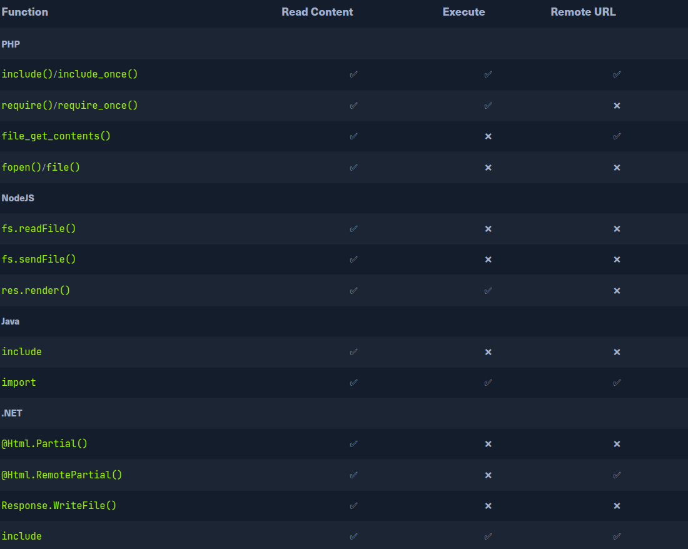

# Intro to File Inclusion:
Many modern back-end lenguages, such PHP, JS or Java use HTML parameters to specify what is shown on th web page, which allows for building dynamic web pages, reduces
the script overall size, and simplifies the code. Parametes are used to specify which resources is shown on the page. If such funtionalities are not securityly
coded, an attackers may manipulate these parameters to diplay the content of any local file on the hosting server leading to a Local DIle Inclusion vulnerability.

## Local File Inclusion:
The most common place we usually find LFI within is templating engines. In order to have most of the web app looking the same when navigating between pages, a templating engines displays a page that
shows the common static parts, such a header, navigation bar, and footer, and then dynamically loads other content that changes between pages. Every page on the server would need
to be modified when changes are made to any of the static parts. This is why we often see a parameter like [/index.php?page=about], where index.php sets static content
and then only pulls the dynamic content specified in the parameter, which in this case mey be read from a file calles about.php.
LFI vulnerabilities can lead to source code disclosure, sensitive data exposure, and even remote code excecution under certain coditions, leaking soruce code may allow attackers to test the code for other
vulnerability, which may reveal previously unknow vulnerabilities.
Leaking sensitive data may enable attackers to enumerate top remote server for other weaknesses or even leak credentials and keys that may allow them to access the remote server directly. Under specific conditions,
LFI may allow attackers to execute code on teh remote server, which may compromise the entire back-end server an any other server connected to it.

## Example of Vulnerble Code:
Let's look at some examples of code Vulnerble to file Inclusion to understand how such vulnerabilities occur. File Inclusion vulnerabilities can occur in may of the most popular web servers and decelopment frameworks, like PHP, NodeJS, Java, .NET, and others.
File could be a dynamic header or different conent based on the user-spececified language. the page may have a [?language] GET parameter, and if a user changes the language form a drop-down menu, the sma page would
be returned bit with a different language parameter.

Changeng the language mayu change the directory the web app is loading the pages form. If we have control over the path begin loaded, then we may be able to exploit this vulnerabilities to read other files and potentially
rech remote execution.
- PHP:
We nay use the iclude() funtion to load a local or a remote file as we load a page. If teh path passed to the include() is taken form a user controlled parameter, like a GET parameter, and the code not explocotly filter and sanitize the user input, then the code
become vulnerable to File Inclusion.:

```php
if (isset($_GET['language'])){
    include($_GET['language'])
}
```

We see that the language parameter is directly passed to the include() funtion. We pass in the language parameter will be loaded on the page, including any lcoal files on the back-end server. This is not exclusive to the include() funtion, as there are many others PHP funtions
that would lead to thge same vulnerability of we had control over the path passed into them. Such funtions [Include_once(), require(), require_once(), file_get_contests)] and several other as well.

> [!NOTE]
> We'll mostly focus on PHP web app running linux back-end server. Most tech and attacks would work on the majority of other frameworks, would be the same with a web app writtenin any other language.

- NodeJS:
Web servers may also load content based on an HTTP parametes. The following is a basic example of how a GET parameter language is used to control what data is written to a page:
```js
if(req.query.language){
    fs.readFile(path.join(__dirname, req.query.language), funtion (err, date){
        res.write(data);
        });
}
```

As we can see, whatever passed form the URL gets used by the [readfile] funtion, which them writes the file content in th HTTP response. Another example is the render() funtion on the Express.js freamework, The following example show how the language parameter is used to dertermine which directory to pull the about.html page form:
```js
app.get("/about/:language", funtion(req,res){
    res.reder(`/${req.params.language}/about.html`);
    })
```
- Java:
The same concept applies to may to many other web server. The following example show how web app for JAVA web server may include local file based on teh specified parameter using include funtions:
```java
<c:if test="${not empty param.language}">
    <jsp:include file="<%= request.getParameter('language') %>" />
</c:if>
```

The include funtion may take a file or a page URL as its arguement and then renders the obj into the front-end template, similar to teh ones we saw earlier with NodeJS. The import funtion may also be used to render a local file or a URL, such a example:
```java
@if (!string.IsNullOrEmpty(HttpContext.Request.Query['language'])) {
    <% Response.WriteFile("<% HttpContext.Request.Query['language'] %>"); %>
}
```
The include funtion may take a file or a page URL as its argument and then render the obj into a the fron-end template, similar to the ones we saw earlier with NODEJS. The import funtion may also be used to render a lcoal file
or a URL, such the following example:

 `<c:import url= "<%= request.getParameter('language') %>"/>`

- .NET:
Let's take a example of how file Inclusion vulnerability may occur in .NET web app. The Response.WriteFile funtion works very similarly to all of our earlier examples, as it takes a file path for its input and write ti content to the response. The path may be reitrived form a GET parameter for dynamic content loading:
```.NET
@if (!string.IsNullOrEmpty(HttpContext.Request.Query['language'])) {
    <% Response.WriteFile("<% HttpContext.Request.Query['language'] %>"); %>
}
```

The @html.Partial() funtion may also be used to render the specified file as part of the front-end template, similary what we sawe earlier:
 `@Html.Partial(HttpContext.Request.Query['language'])`
___

## Read vs execute:


