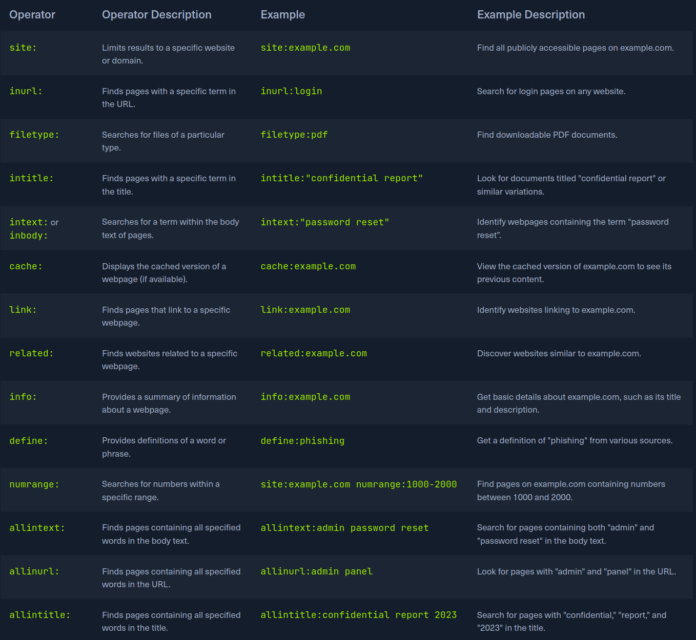
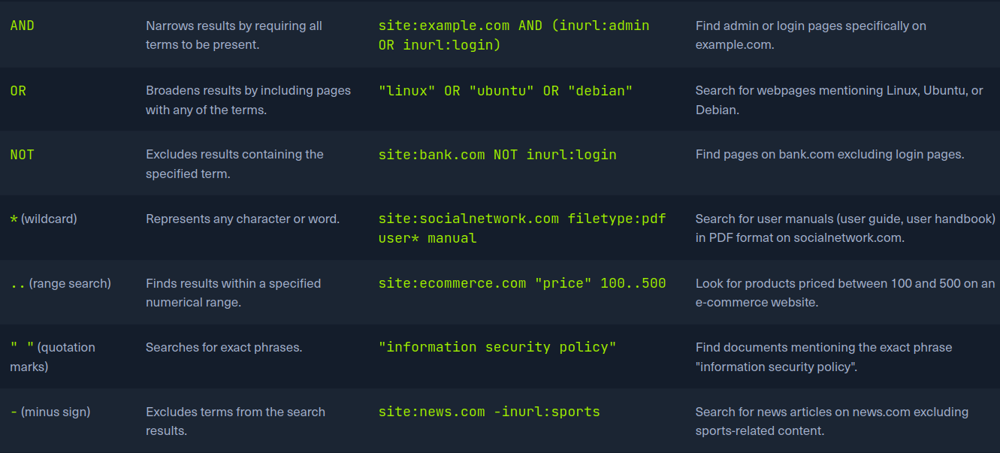

# Crawling:
Often called spidering, is the automated process of sytematically browsing th World Wide Web. Similar to how a spider navigate its navigate its web,
a web crawler follow links form one page to anothr, collection information. These crawlers are essentiially bots that use pre-defined algorithms to discover
and index web pages, making them accessible through search egines or for other purpouse like data and web reconnaissance.
- How web Crawlers work:
    The basic operation of a web crawler is straightforward yet powerful. It starts with a seed URL, which is the initial web page to crawl.
    The crawler fetches this page, parses its content, and extracts all its links. It then adds these links to a queue and crawls them, repeating the process iteratively.
    Depending on its scope and configuration, the crawler can explore an entire website or even a vast portion of the web.

1. Home page: Start with the homepage containing link1, link2 and link3.
2. Visiting link1: visiting link1 shows the homepage, link2, and also link4 and link5.
3. Containing the crawl: The crawl: The crawler continuous to follow these links systematically gethering, all accessible pages an their links.
- Breadth-first crawling:
This example illustrates how a web crawker discovers and collects information by sytematically following links, disitingushing it form fuzzing which involves guessing potencial links.
Breadth-first  crawling prioritizes exploring a website's width fore going deep. It start crawling all the links on the seed page, the moces on the links on those pages, and  so on.
This is useful for getting broad overview of a website's structure and content.

- Deepth-First Crawling:
In contrast, Deepth-First crawling prioritizes depth over breadth. It follows a single paath of a link as far as possible before backtracking and exploring other paths. This can be useful
for finding content or reaching deep into a website's structure.

##  Extracting Values information:
1. Links (Internal and external): these are the fundamental building blocks os the web, connecting pages within a website(internal link) an the other website(external link). Meticulously collect these links,
allowing u map to out websuite structure, discover hidden pages, and identify relationship with external resources.
2. Comments: Section on blogs forums, or other interactive pages can goldmine of information. Users often inavertently reveal sesitive details, internal processes, or hints of vulnerabilities in their comments.
3. Metadata: Referes to data about data, in the context of webpages, it includes information like pages titles, description, keywords, author names, and dates. This metadata can provide valuable context about a pages's content,
purpouse, and relevance to ur reconnaissance goals.
4. Sensitive Files: Web crawler can be configured to actively search for sesitive files that might be inadvertently exposed on a website. this includes backfile(.bak, .old), configuration files(web.config, settings.php),
log files(error_log, Access_log) and other files extracted files, especially backup and configuration files, can reveal a trove of sensitive information, such as databases, encrypted keys, or even source code snippets.

- The important of Context:
Undestanstanding thje context surrounding the extracted data is paramount.
A single piece of information, like comment metioning a specific sofware version, might not seem significant on its own, When combine with other findings- such a outdatad version listed in metadata or a petencially vulnerable
configuration file discoverd thorough crawling- it can transform into a critical indicator of potential vulnerability.
The true value of extracted data lies in connection the dots and contrusting a compenhensive picture of the target's digital landscape.
A list of extracteed links might initially appaear mundane. Upon closer examination, u notice pattern: several URLs point to a directory name /files/.  This triggers u curiosity, and u decide to manually visit the directory. To ur
surprise, u find that directory browsing is enebled, exposing a hsot of files, including backup archives, internal documents, and potentially sesitive data.
A comment mentioning a "file server" might not raise any red flags initially.

# Robots.txt
Imagine you're a guest at a grand house party. While ure free to mingle and explore, there might be certain rooms marked "Private" that you're expected  to avoid. this is akin to how Robots.txt
funtions in the world of web crawling. It acts as a virtual "etiquette guide" for bots, outlining which areas of webisite they are allowed to access and which are off-limits.
Technically, robots.txt is a simple file placed in the root directory of a website[www.example.com/robots.txt], its adheres to the robots exlusion standard. guidelines for how  web crewlers should  behave when visiting a website.
This file contains instructions in the from of "directives" that tell bots parts of the website they can and cannot crawl.
- How works?
The directives in robots.txt typically target specific user-agents, which are identifier for dff types of bots.
`User-agent: *
Disallow: /private/`
This directibe tells all user-agents(* is a wildcard) that they are not allowed to access any URLs that start with /private/, other directive can allow access to specific directories  or files, set crawl delays to avoid overloading
a server or provide links to sitemaps for effecient crawling.
- Undestanding robots.txt Structure:
Is a file text is a plain text document that live in the root directory of a websitem, it follows a straghtfoward structure, with each set a instruction, or "record" separated by a blank line.
1. User-agent: This line specifies which crawler or bot the following rule apply to, a wildcard(*) indicates that the rules apply to all bots. Specific user agents can also be targeted, such as "googlebot" or "bingbot".
2. Directives: these lines provide specific intructions to the indetifies user-agent.

Common directives include:

| Directive | Description | Exmaple |
| --------------- | --------------- | --------------- |
| Disallow | Specifies paths or patterns that the bot should not crawl | Disallow: /admin/  |
| Allow  | Explocity permits the bot to crawl specifc paths or patterns, even id they fall under a boader Disallow| Allow /public/ |
| Crawls-Delay|Sets a delay between seccessive requests form the bot to avoid overloading the server | Crawl-delay: 10 |
| Sitemap |Provide the URL to XML sitemap for more efficient crawling | Sitemap: https://www.example.com/sitemap.xml |

## robots.txt in Web reconnaissance:
- Uncovering Hidden Directiries: Disallow paths in robots.txt often point to directories or files the website owner  intentionally want to keep out of from reach form search engine  crealers.
These hidden areas might house sesitive information, backup files, admin panels, or other resources that could interest an attacker.
- Mapping Website Structrure: By analyzing the allowed and Disallow paths, security professionals can create a rudimentary map od the website's structure. This can reveal that are not linked
form the main navigation, potentially leading ro undicovered pages or funcionalities.
- Detecting Crawler Traps: Some website intentionally include "honeypot" directories in robots.txt to lure malicius bots. Identifying such
traps can provide insights into target's security awareness and defesive mesure.

- analyzing robots.txt:
```txt
User-agent: *
Disallow: /admin/
Disallow: /private/
Allow: /public/

User-agent: Googlebot
Crawl-delay: 10

Sitemap: https://www.example.com/sitemap.xml
```
This fiel contains the following directories:
1. All user agents are Disallow from accesing the /admin/ and /private/ directories.
2. Al user agents are allowed to access the /public/ directory.
3. The Googlebot is specifically intructed to wait 10 seconds between request.
4. The sitemap, located at https://www.example.com/sitemap.xml. is provided for ez crawling and indexing.


## Well-Known URLs:
The .well-know standard, defined in RFC 8615, serves as a standardized directory within website root domain, this designed location, typically accessible via the /.well-know/ path on a web server,
centralizes a website's critical metadata, including configuration files and information related to its services, protocols, and security mechanims.
By establishing a consisitent location for such data, .well-know simplifies the discovery and access process for various stakeholders, including web browser app and security tools.
This streamlined approach enables clients to automatically locate and reitrive specific confi files by contrusting the appropiate URL.
The internet assigned number authority(IANA) maintains a registry of well-know URL, each serving a specific purpouse defined by various specifications and standard.

| URL Suffix | Description | Status | Reference |
| --------------- | --------------- | --------------- | --------------- |
|security.txt |Contains info for security researches to report vulnerabilities |Permanent |RFC 91116 |
|.well-know/change-password |Provides a standard URL for directing users to a pass changes page |Provisional |https://w3c.github.io/webappsec-change-password-url/#the-change-password-well-known-uri |
|openid-configuration| Defines configuration details for OpenID connect an identify layer on top od the OAth 2.0 protocol |Permanent | http://openid.net/specs/openid-connect-discovery-1_0.html |
| assetlinks.json|Used for verifying ownership of digital assent |Permanent | https://github.com/google/digitalassetlinks/blob/master/well-known/specification.md|
|mta-sts.txt |Specific the policy for SMTP MTA Strict Transport security to enhave email security |Permanent |RFC 8461 |

This is just a small sample of the many .well-know URLs registered with IANA. Entry in the registry offers specific guidelines and requirements for implements, ensuring a standardlized approach to leveraining the .well-know
mechanims for varius applications.

## Web recon and .well-know:
The .well-know urls cna be inavaluable for discovering endpoints and configurations detais that can be furher tested during a pentetration test.
Open particulay  useful URL is openid-configuration.
The configuration URL is part opf the OpenID Connect decovery protocol, and identify layer built on top of the OAuth 2.0 protocol.
[https://example.com/.well-known/openid-configuration] endpoint.

```json
{
  "issuer": "https://example.com",
  "authorization_endpoint": "https://example.com/oauth2/authorize",
  "token_endpoint": "https://example.com/oauth2/token",
  "userinfo_endpoint": "https://example.com/oauth2/userinfo",
  "jwks_uri": "https://example.com/oauth2/jwks",
  "response_types_supported": ["code", "token", "id_token"],
  "subject_types_supported": ["public"],
  "id_token_signing_alg_values_supported": ["RS256"],
  "scopes_supported": ["openid", "profile", "email"]
}
```

The information obtained form the openid-configuration endpoint multiple provide exploration opportunities:
1. Endpoints dicovery:
    - Authorization Endpoint: Identifying the URL for user auth request.
    - Token Endpoint : Finding the URL where tokens are issued.
    - USerinfo endpoint: Locating the endpoint that provides user info.
2. JWKS URL: The jwks_uri reveals the json web key set, detailing the cryptograhpic keys used by the server.
3. Supported Scopes and Response type: Undestanding which scope and responde types are supported helps in mapping out funcionality and limitations of the OpenID  connect implementation.
4. Algorithm Details: information about supp signing algorithms can be crucial for understanding the security measure in place.
[IANA](https://www.iana.org/assignments/well-known-uris/well-known-uris.xhtml)

# Creepy Crawlies:
- Popular Web Crawler:
1. Burpsuite spider: a widely used app testing plataform, includes a powerful active crawlcalled Spider, excels at mapping out web app, Identifying hidden content and uncovering potential vulnerabilities.
2. OWASP ZAP(Zed Attack proxy): is a free, opensource web app security scanner, it cab be used in automated and manual modes and includes a spider component to crawl web app and identify potential vulnerabilities.
3. Scrapy(Python): Is a versatile and scalable python framework for building custom web crawlers. Provide rich ft for extracting structuered data from websited, handling complex crawling scenearion, and automating data
processing. Its flexibility makes it ideal tailored reconnaissance tasks.
4. Apache Nutch (Scalable Crawler): is  highly extensible and scalable open-source web crawler written in Java. It's designed to handle massive crawls  acrooss the entire web or focus on specific
domains.

## Scrapy:
Reconspider --> `python3 Reconspider url`, output the json result and we can see the list of the results.

## Search engine dicovery:
Beyonf their primary funtions of answering queireies, search engines also hold a treasure trove of data that can be invaluable for web reconnaissance and information gathering.
At its core, search discovery leverages the immense power of search algotithms to extract data that may o be readilu visible on websites.
- Why Search Engine dicovery Matters:
    - Open Sources: The information gathered is publicly accesible, making it legal and ethical way gain insighs into a target.
    - Breadth of information: Serch enginies indeddx a vast portion od the web, offering a wide range of portential information sources.
    - Ease of Use: Search enginies are user-friendly and requieres no specialised tech skills.
    - Cost-Effective: It's free and readily avaliable resource for information gathering.
The information u can pull together form Search Engine can be applied in several different ways as well.
    - Security Assesment: Identifying vulnerabilities, exposed data, and potential attacks vectors.
    - Competitive Intelligence: Gathering information about competitors products, services, and strategies.
    - Investigate Journalism: Uncovering hidden connection, finanacial trasactions, and unethical practice.
    - Threat Intelligence: Identifying emerging threats, tracking malicius actors, and predicing portencial attacks.

- Search Operators:



- Google dorking: Is also as google hacking, is a tech that leverges the power of search operators to uncover sensitive information, security vulnerabilities or hidden content
on the website.
Some common examples [google hacking database](https://www.exploit-db.com/google-hacking-database):
    - Finding login pages:
        - site:example.com inurl: login
        - site:example.com (inurl: login OR inurl: admin)
    - Identifying Exposed Files:
        - site:example.com filetype:pdf
        - site:example.com (filetype:xls OR filetype:docx)
    - Uncovering configuration files:
        - site: example.com inurl:config.php
        - site:example.com (ext:conf OR ext:cnf) (searches for extensions commonly used for configuration files)
    - Locating Database backup:
        - site: example.com inurl:backup
        - site: example.com filetype:sql

# Web archives:
Webisite come and go, leabing fleting traces od their existence behind. [Internet Arcive's Wayback Machine](https://web.archive.org/)
- How does the Wayback Machine Work:

Operates by using web crawler to capture snapshots of website at regular interval automatically, these crawler navigate through the web, following links na d indexing pages, much like how search
engine crawlers work.


1. Crawling: Employs automate web crawlers, often called "bots", to browse the internet systematically. These bots follow the links form onw website to another, like how
would click hyperlink to explotre a website. Intead of just reading the content, these bots dowload copies of the webpages they encounters.
2. Archiving: Each capute webpage is linked to a specific date and time, creating snapshots os the website at that moment. This archiving process happens at regular intervals, somotimes daily, or monthy.
3. Accessing: User can access these archived snapshots through the wayback machine interface, enter the URL.

- Why the Wayback Machine matters for web reconnaissance:

1. Uncovering Hidden Assets and vulnerabilities: Allows u to discover old web pages, directories, files, or subdomains that not be accesible on the current website.
2. Tracking changes and Identifying Patterns: Comparing historical snapshots, u can observe how the website has evolved reveling changes in structure, content, and potencial vulnerabilities.
3. Gathering Intelligence: Archived content can be valuable source of OSINT, providing insight into the target past activities, marketing, employees, and tech choices.
4. Stealthy reconnaissance: Accessing archived snapshots it a passive activity that doesen't directly interact with the target's infraestructure, making a less detectable way to gather information.

# Automating Recon:
This task can significantly enhace and accuracy, allowing u to gather information at scalew and identify potential vulnerabilities more rapidly.
- Why Automate reconnaissance:
    - Efficiency: automated tools can perform repetitive tasks much faster than humans, freeing up valuable time for analysis decision-making.
    - Scalability: Automation allows u to scale reconnaissance efforts across a large number of targerts or domains, uncovering a broader scope infromation.
    - Consitency: Automated tools follow predefined rules and procedures, ensuring consisitent and reproducible results ans minmising the risk of human error.
    - Compenhensive coverage: Automation can be programmed to perform a wide range of reconnaissance tasks, including DNS enumeration, subdomain discovery, web crawling, port scanning nad more ensuring through coverage of potential attack vectors.
    - Integration: Many automation framework allow for ez integration with other tools and plataforms, creating a seamless workflow form reconnaissance to vulnerability Assesment explotation.

## Reconnaissance frameworks:
1. Finalrecon: Python-based reconnaissance tool offering a range of modules for diff task like SSL certificate checking, whois information gathering, header analysis, and crawling.
2. Recon-ng: Powerful framework written in py that offer a modular structure with varius modules for diff reconnaissance tasks. Perform DNS enumeration, subdomain discovery, port scanning , web crawling, and even exploit know vulnerabilities.
3. theHarvester: Specifically designed for gathering mail addr, subdomains, hosts, employee, names, open port, and banners form diff public source like search egines, PGP key servers,m and SHodan databases.
4. SpiderFoot: open-source intelligence auto tool that integrates with variuous data source to collect information about targets, including IP addr, domain names, mail and social media profiles.
5. OSINT framework: Collection of varius tools and resources for open-source intelligence gathering. Covers a wide range of information source, including social media, search engines...

- FinalRecon:
    - Header Information: Reveals sever details, tech used, and potential security misconfiguration.
    - Whois lookup: Uncovers domain registration details, including registrant infromation and contact details.
    - SSL Certificate Information: Examine the SSL/TLS certificate for validaty, issuer, and other relevant.
    - Crawler:
        - HTML, CSS, JS
        - Internal/External Link
        - Image, robots.txt, sitemap.xml
        - Link in JS
    - DNS enumeration: Queries over 40 DNS record types, including DMARC records dore mail security assessment.
    - Subdomain Enumeration: leverages multiple data sources to discover subdomains.
    - Directory Enumeration: Supp custom wordlist and file extensions to uncover hidden directories and files.
    - Wayback Machine

### FINALRECON:
[-h --help] show the help message
[--url] Specify the target URL
[--headers] Header information for target url.
[--sslinfo] Get ssl certificate information for url
[--whois] Perform a whois lookup
[--crawl] Crawl the target web
[--dns] DNS enumeration on the target domain.
[--sub] Enumerate subdomain
[--dir] Directories on the targets
[--wayback] Wayback url
[--ps] Perform a fast port on target
[--full] Perform a full reconnaissance scan on the target

```sh
./finalrecon.py --headers --whois --url http://inlanefreight.com
 ______  __   __   __   ______   __
/\  ___\/\ \ /\ "-.\ \ /\  __ \ /\ \
\ \  __\\ \ \\ \ \-.  \\ \  __ \\ \ \____
 \ \_\   \ \_\\ \_\\"\_\\ \_\ \_\\ \_____\
  \/_/    \/_/ \/_/ \/_/ \/_/\/_/ \/_____/
 ______   ______   ______   ______   __   __
/\  == \ /\  ___\ /\  ___\ /\  __ \ /\ "-.\ \
\ \  __< \ \  __\ \ \ \____\ \ \/\ \\ \ \-.  \
 \ \_\ \_\\ \_____\\ \_____\\ \_____\\ \_\\"\_\
  \/_/ /_/ \/_____/ \/_____/ \/_____/ \/_/ \/_/
[>] Created By   : thewhiteh4t
 |---> Twitter   : https://twitter.com/thewhiteh4t
 |---> Community : https://twc1rcle.com/
[>] Version      : 1.1.7
[+] Target : http://inlanefreight.com
[+] IP Address : 134.209.24.248
[!] Headers :
Date : Wed, 19 Mar 2025 09:44:43 GMT
Server : Apache/2.4.41 (Ubuntu)
Link : <https://www.inlanefreight.com/index.php/wp-json/>; rel="https://api.w.org/", <https://www.inlanefreight.com/index.php/wp-json/wp/v2/pages/7>; rel="alternate"; type="application/json", <https://www.inlanefreight.com/>; rel=shortlink
Vary : Accept-Encoding
Content-Encoding : gzip
Content-Length : 5483
Keep-Alive : timeout=5, max=100
Connection : Keep-Alive
Content-Type : text/html; charset=UTF-8
[!] Whois Lookup :
   Domain Name: INLANEFREIGHT.COM
   Registry Domain ID: 2420436757_DOMAIN_COM-VRSN
   Registrar WHOIS Server: whois.registrar.amazon.com
   Registrar URL: http://registrar.amazon.com
   Updated Date: 2024-07-02T22:07:11Z
   Creation Date: 2019-08-05T22:43:09Z
   Registry Expiry Date: 2025-08-05T22:43:09Z
   Registrar: Amazon Registrar, Inc.
   Registrar IANA ID: 468
   Registrar Abuse Contact Email: trustandsafety@support.aws.com
   Registrar Abuse Contact Phone: +1.2024422253
   Domain Status: clientDeleteProhibited https://icann.org/epp#clientDeleteProhibited
   Domain Status: clientTransferProhibited https://icann.org/epp#clientTransferProhibited
   Domain Status: clientUpdateProhibited https://icann.org/epp#clientUpdateProhibited
   Name Server: NS-1303.AWSDNS-34.ORG
   Name Server: NS-1580.AWSDNS-05.CO.UK
   Name Server: NS-161.AWSDNS-20.COM
   Name Server: NS-671.AWSDNS-19.NET
   DNSSEC: unsigned
   URL of the ICANN Whois Inaccuracy Complaint Form: https://www.icann.org/wicf/
[+] Completed in 0:00:00.972663
```


