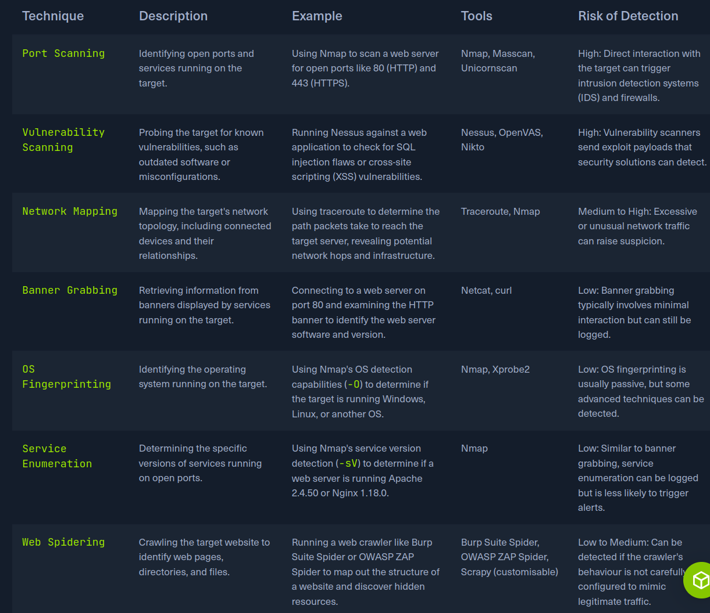
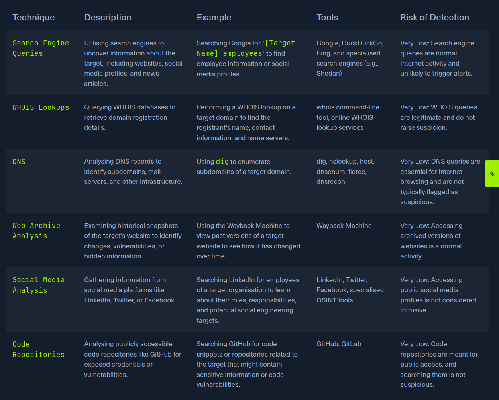

# Web reconnassace:
Is the foundation of thourgh security assessment, this proceess involves systematically and meticulosily collecting information about target
web or web app.
Critical part of the "Information Gathering" phase of the Pentest/

The primary goals of web reconnaissece includes:
1. Identifying Assents: Uncovering all publicy accesible compenents of the target, such as web page, subdoamians, IP addr, and tech. This steps provides a comprenhsive overvie of the target's online presence.
2. Discovering Hidden Information: Location sensitive information that might be inadvertenly exposed, including backup files, configuration files, or internal documentacio
3. Analysing the Attack Surface: Examining the target's attack surface toi identify potencial vulnearabilities and weaknesses.
4. Gathering Intelligence: Collecting information that can be levereg for further explotation or social engineering attack.

## Types of Reconnaissance:
Active or passive.

- Active Reconnaissance: The attacker directly interact with the target system to gather information, this reconnaissece provides a direct and often more compresive veiw
of the target infrastructure and security postuere, it also carrier higher risk of detection, as the interact with the target trigger alerts.

- Passive Reconnaissance:
This involve gathering information about the target without directly interacting with it, is generally stealthier and lees likely to trigger alarm active reconnaissece.

