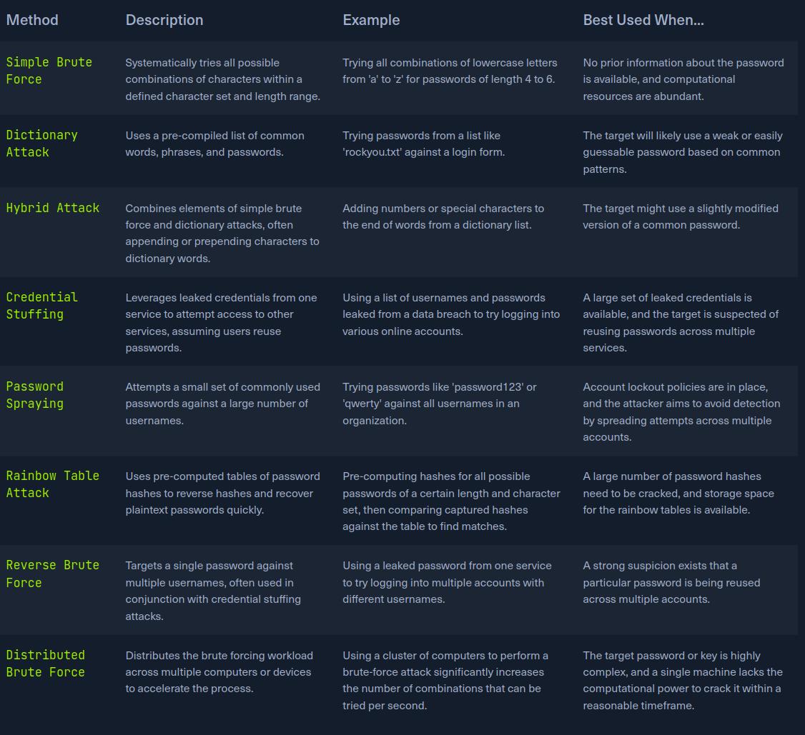
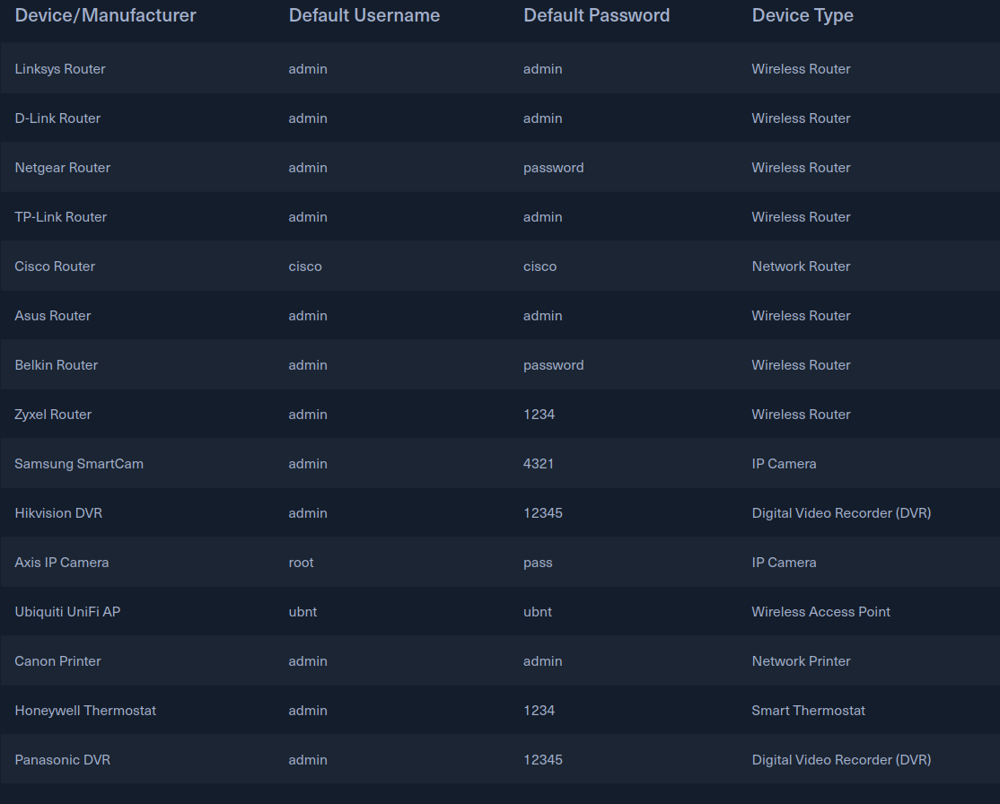

# Introduction:
- WHAT IS BRUTE FORCE:
Is a trial-and-error method ussed to crack pass, login credentials, or encryption keys. It involves systematically trying every possible combination
of characters until the correct one is found. The process can be likened to a thief trying every key on giant keyring until they find the one unlocks
the treasure chest. The success of a brute force attack depends on several factors:
    - The complexity of the password or key. Longer the passoword with a mix of uppercase and lowercase letters, numbers, and symbols are exponentially more complex
    to crack.
    - The computational power avaliable to teh attacker modern computers and spceialized can try billions of combinationper second, significally reducing
    the time neeeded for a successful.
    - The security mesures in places, account lockouts, CAPTCHAs, and other defenses con slow down or even thwart brute-force attempts.

- How brute force works:

1. Start: The attacker initiates the brute-force process, often with aid of specialized sofware.
2. Generate Possible Combination: The sofware generatess a potential pass or key combination based on predefined parameter, sich as charactr sets an length.
3. Apply Combination: The generate combination is attempted the target system, such as login form or encrypted file.
4. Check if Successful: The system evaluates the attempts combination. If it matches the stored pass or key, access is granted, the proccess continues
5. Access Granted: the attacker gain unanthorized access t the system or data.
6. End: The process repeats, generating and testing new combinations until either the correct one is found or the attacker gives up.

- Types od Brute Forcing:
Is not a monolithic enitity but collection of diverses tech, each will its strngths, weaknesses, and ideal use cases, Understanding these variations is crucial
for both attackers and defenders, as it enables the former to choose the mos effective approach and the latter to implement targeted countermeasures. The following
table provides a comparative overview of varius brute-force methos:

The role of Brute Forcing in Penetration testing:
Encompass a range of tech, brute forcing is often strategically employed when:
1. Other aveneus are exhausted: Initial attempts to gain access, such as explotating know vulnerabilities or utilizing social engeniering tactics.
2. Password policies are weak: If the target system employs lax password policies, it increases the likelihood of users having a weak or ez guessable pass.
3. Specific accounts are targeted: Penetratrion tester may focus on comprimising specific user account, sich as those with elevated privilege.

# Password security fundamentals:

The effectiveness of brute-force attacks hinges on the strength of the pass it targets, the fundamental of pass security is crucial for appreciating the importance
of robust pass practise and the changelles posed by brute-force attacks.

- The importance of Strong pass:
A strong pass ios a formidable barrier, making it significantly for attackers to gain unanthorized access thorough brute forcing or other tech, the longer
and more complex a pass, is the more combination an attackers has to try.

- Anatomy of a strong password:
The NIST create this characterisitics:
    - Length: The longer password the better, For minimun of 12 characters, but longer is always preferable, the reasoning is simple: each additional character in a pass dramatically
    increase the number of possible combinations. For instance, a 6-characters pass using only lowercase letters has 26^6 [300 millons] combinations. In contrast,
    an 8-characters password has 26^8[200 billon] combinations.
    - Complexity: Use uppercase and lowercase letter, number, and symbols. Avoid quickly guessable patterns or sequences. Including different character types expands the pool
    of potential character for each position in the pass. Pass using only lowercase letters has 26 posibilities character, while a pass using both upper and lower has 52 posobilities
    per character.
    - Uniqueness: Each account have has a unique and string pass.
    - Radomness: USing dict of words, personal information, or common pharses. The more random pass, the hard to crack.

- Common Passwords Weakness:
    - Short Password: Password with fewer than eight characters are particulary vulnerable to brute-force.
    - Common Words and pharses: Names, dictwords...
    - Personal inforamtion
    - Reusing Passwords: Using the same pass across multiple accounts is risky, If someone account is comprensed, all other accounts usin the same pass are also at risk.
    - Predictable Patterns: Using patterns like "qwerty" or "123456" or simple substitutions like "p@ssw0rd" makes passwords easy to guess.

- Password Policies:
    - Minimun length
    - Complexity
    - Pass expiration
    - Pass history

- The perils of credentials:
One critical aspect of pass security often overlook is danger posed by def pass. these pre-set pass come with varius devices or online services. The provide an ez entry point into systems and networks leading
malicius activities:

Alongside def pass, username are another major security concern, Ofthe ship with pre-set username admin, root o user. Seclist[top-usernames-shortlist.txt].

- Brute-forcing and Password security:
Security posture:
    - Evaluating Sytem vulnerabilities: password policies, or their absence, and the likelihood of users employing weak pass directly inform potential sucess of a brute-force attack.
    - Strategic Tool selection: Complexity of the pass dictates the tools and methodologies a penterste will deploy
    - Resource Allocation: Estimate time and computational power needed for a brute-force attack is intrinsically linked to the complexity of the pass.
    - Default pass are often system achille heel.

