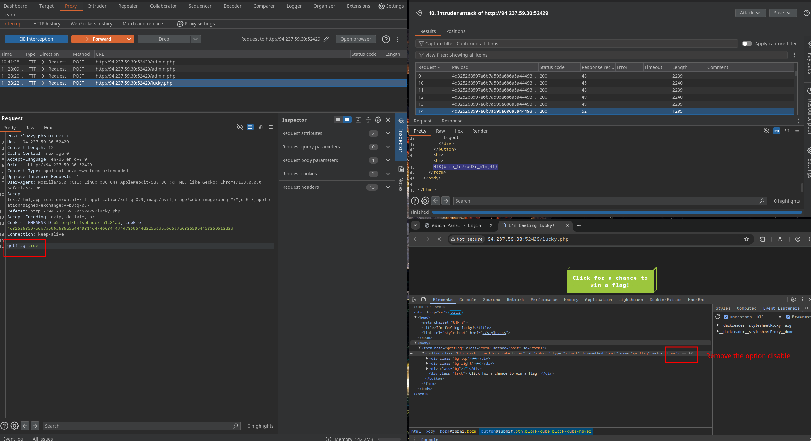
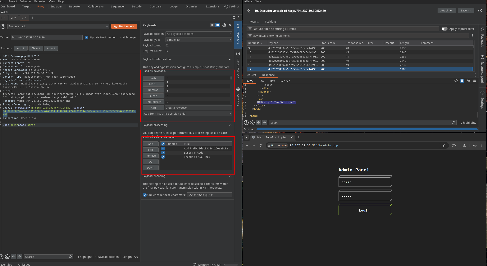

1. The /lucky.php page has a button that appears to be disabled. Try to enable the button, and then click it to get the flag.
Remove the option disable


2. The /admin.php page uses a cookie that has been encoded multiple times. Try to decode the cookie until you get a value with 31-characters. Submit the value as the answer. :
Decode in cyberchef:
3dac93b8cd250aa8c1a36fffc79a17a

3. Once you decode the cookie, you will notice that it is only 31 characters long, which appears to be an md5 hash missing its last character. So, try to fuzz the last character of the decoded md5 cookie with all alpha-numeric characters, while encoding each request with the encoding methods you identified above. (You may use the "alphanum-case.txt" wordlist from Seclist for the payload)


We can se in the lengh is other value.

4.You are using the 'auxiliary/scanner/http/coldfusion_locale_traversal' tool within Metasploit, but it is not working properly for you. You decide to capture the request sent by Metasploit so you can manually verify it and repeat it. Once you capture the request, what is the 'XXXXX' directory being called in '/XXXXX/administrator/..'?
```sh
msf6 auxiliary(scanner/http/coldfusion_locale_traversal) > set rhosts  94.237.59.30
rhosts => 94.237.59.30
msf6 auxiliary(scanner/http/coldfusion_locale_traversal) > set rport 52429
rport => 52429
msf6 auxiliary(scanner/http/coldfusion_locale_traversal) > run
[*] Scanned 1 of 1 hosts (100% complete)
[*] Auxiliary module execution completed
msf6 auxiliary(scanner/http/coldfusion_locale_traversal) > set proxies http:127.0.0.1:8080
proxies => http:127.0.0.1:8080
msf6 auxiliary(scanner/http/coldfusion_locale_traversal) > run

```
On burp:
GET /CFIDE/administrator/index.cfm HTTP/1.1
https://academy.hackthebox.com/achievement/349590/110
